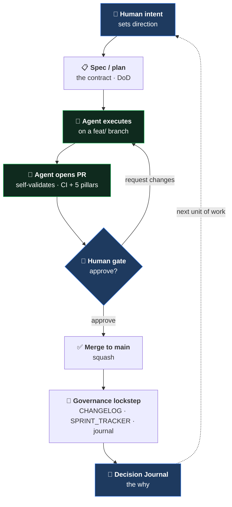
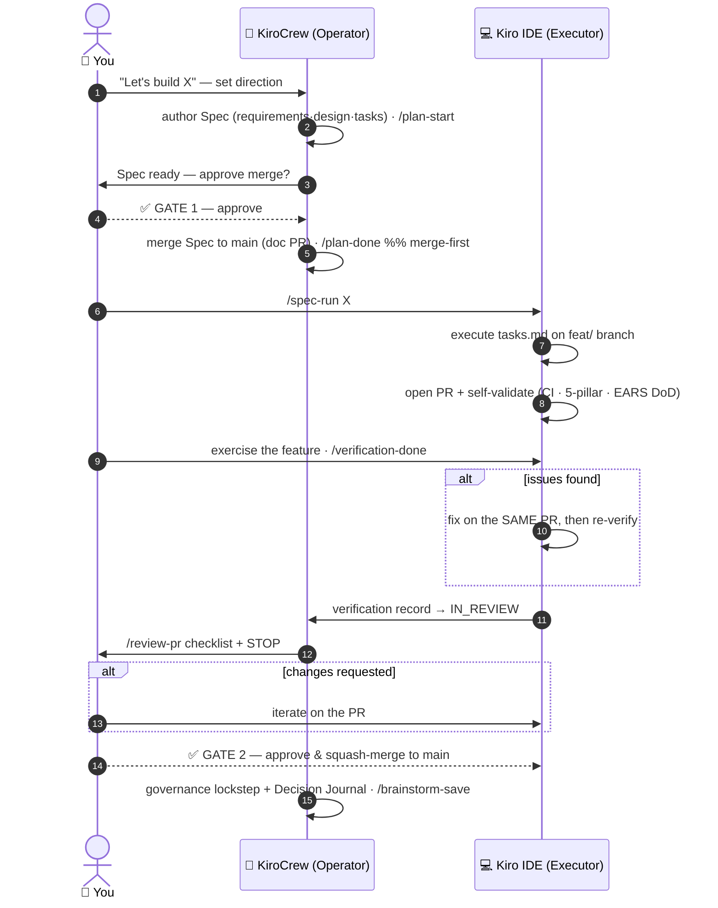

[🏠 Cetana Labs](../../README.md) / [📚 Docs](../README.md) / Governance / **AI Collaboration Model**

# AI Collaboration Model — Cetana Labs

> How engineering work is done here: a **human-directed, AI-assisted, human-gated** method.
> This document describes the *methodology* — the repeatable way a human engineer and AI
> agents collaborate to ship governed software. It is a companion to the
> [Decision Journal](DECISION-JOURNAL.md) (the *reasoning* record) and the RFCs (the *formal
> decisions*).

---

## 1. Principle

**The human sets direction and gates every merge; AI agents execute, validate, and surface trade-offs.**

Decisions are the human's. Execution is AI-accelerated. Nothing reaches `main` without a
human-approved, CI-gated pull request. This keeps velocity high *and* accountability clear.

## 2. Two surfaces, two roles (RFC-LAB-000-007)

| Surface | Role | Used for |
| :--- | :--- | :--- |
| **KiroCrew** (Operator) | **Brainstorm, plan & govern** (stateful) | Direction-setting, RFCs, Spec authoring, scoping, decision capture, governance ops, PR review, persistent per-project memory |
| **Kiro IDE** (Executor/Worker, local) | **Execute & verify** (stateful) | Running the stack, DB work, UI dev, `/spec-run`, local verification, pushing `feat/` branches |
| **Background worker** (Operator-spawned) | **Delegated specialist work** (bounded, gate-free) | Reversible, off-protected-path tasks the Operator delegates in parallel: research, analysis, doc drafts, diagram data, scoped investigations, bulk processing. Returns a result the Operator validates + reports |
| **Kiro Web** | **Stateless fallback** | Throwaway brainstorm with no persistent memory, no-install access from any machine, config-sync parity checks |

Brainstorming, planning, and governance happen on the **Operator** (KiroCrew) — where iteration
is cheap *and* memory persists across sessions; execution and verification happen on the
**Executor** (Kiro IDE), where the running system lives. **Kiro Web** is a stateless fallback
only — use it when you explicitly want no persistent memory or are working without the KiroCrew
app. The same repo config (`.kiro/`) travels to all three.

> The Operator never merges — it opens PRs, self-validates, and STOP-and-holds at the human gate
> (§3, §6). Decisions and coordination default to the Operator; code execution is delegated to the
> Executor. (This renames and expands the original Web/IDE split: KiroCrew absorbs and extends the
> former "Kiro Web = brainstorm & plan" role with persistence, crons, and orchestration.)

> **Background-worker lane (gate-free, bounded).** Not everything needs the full `/spec-run → PR →
> verify → review` cycle. For **bounded, reversible, off-protected-path** specialist work (research,
> analysis, doc drafts, diagram data, a scoped investigation, bulk processing), the Operator may
> **spawn a background worker** (`spawn_run`) that runs in parallel and returns a result the Operator
> validates and reports. **The merge gate is unchanged:** a worker **never pushes `main` and never
> merges** — if its output is code destined for `main`, it still flows through `/spec-run` + a PR +
> the human gate. The worker produces the *artifact* (a draft, a branch, a findings doc); the gate
> still decides what lands. Use the full IDE Executor path for anything that becomes a `main` code change.

> **Workspace isolation.** The Operator and the Executor work in **separate clones** of the repo
> (e.g. Operator in `cetana-labs/`, the IDE Executor in a sibling `cetana-labs-kiro-ide/`), syncing
> only through `origin` — never through a shared working tree. This prevents two writers racing on
> one worktree (the hazard that a shared tree creates when a `/spec-run` build and an Operator edit
> overlap), and lets the Operator safely spawn background workers without colliding with an IDE run.

## 3. The loop

- **Contract:** for delegated/agent work, a **Kiro Spec** (`requirements.md` EARS acceptance criteria = Definition of Done, `design.md`, `tasks.md`). For solo-pairing, a lighter ask.
- **Execution:** agent works on a `feat/` branch (GitHub Flow, hybrid path-scoped — RFC-LAB-000-004).
- **Validation:** `make validate-local` / the 5-pillar governance gate; CI mirrors it on the PR.
- **Human gate:** PR review (`/review-pr`, planned) + STOP-and-hold; nothing merges unapproved.
- **Record:** CHANGELOG (what), RFCs (formal decision), Decision Journal (how/why).

### 3.1 One complete cycle — sequence of execution

The flowchart above shows the *states*; this sequence shows the **handoffs over time** between the
three actors — 👤 **You** (direction + both gates), 🤖 **KiroCrew** (Operator — brainstorm, Spec,
review surface, lockstep), 💻 **Kiro IDE** (Executor — build, PR, verify). Kiro Web (stateless
fallback) is not a participant in the execution flow.

- **Two human gates:** ④ approve the Spec merge, and the final approve & squash-merge. Nothing crosses to `main` without you.
- **Two loop-backs:** verification finds issues (fixed on the same PR, Single-PR rule) and review requests changes (iterate on the PR).
- **Merge-first ordering:** the Spec merges to `main` (step 5) *before* the first `/spec-run` (step 6) — that is what lets `/spec-run` be a clean IDE one-liner.

## 4. Progressive formality (scales solo → team)

Contract depth scales with executor autonomy — light where context is shared, full where it isn't:

| Executor | Contract | Why |
| :--- | :--- | :--- |
| **Lead-paired** (human + AI, live) | Lightweight (backlog row / quick spec) | Context supplied conversationally |
| **Delegated agent** (AIDLC) | **Full Kiro Spec** | The agent has no conversational context — the Spec *is* its brief |
| **Onboarded developer** | Full Kiro Spec | Cold pickup needs the complete contract + DoD |

The model is defined by **executor role**, not named people — so it scales as developers and
agents onboard without a process rewrite.

## 5. AI-Driven Development Lifecycle (AIDLC) — the experiment

The forward experiment: delegate a well-scoped sprint to an agent, human-gated throughout.
- **Spec in** → **Autonomous execution** (plan → sub-agents build → PR) → **human PR gate** → merge.
- Built on **Kiro-native** features (Specs, Autonomous mode) — not a homegrown system.
- First trial: MVP task **M1** (wire the UI to live PocketBase) authored as a Spec.

## 6. Governance guarantees (why this is trustworthy, not just fast)

- **Human gate:** every merge is human-approved (the AIDLC safety rail).
- **CI-gated:** portfolio + 5-pillar + build checks must pass before merge.
- **Lockstep:** CHANGELOG / BACKLOG / journal / `data/` stay synchronized (validator-enforced).
- **Auditable reasoning:** the Decision Journal records *why*, with honest failure/recovery notes.
- **Linear history:** squash-merge, branch deletion, no force-push to `main`.

## 7. Evidence (this repo)

The method is dogfooded here: a portfolio control plane evolving into a governed web app, via
**9+ RFCs**, **12+ CI-gated PRs**, and staged releases — every decision recorded, every merge
gated. See [`DECISION-JOURNAL.md`](DECISION-JOURNAL.md) and [`docs/rfc/`](../rfc/).
