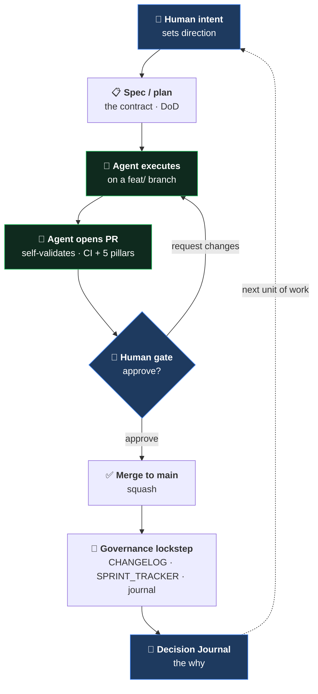

[🏠 Cetana Labs](../../README.md) / [📚 Docs](../README.md) / Governance / **AI Collaboration Model**

# AI Collaboration Model — Cetana Labs

> How engineering work is done here: a **human-directed, AI-assisted, human-gated** method.
> This document describes the *methodology* — the repeatable way a human engineer and AI
> agents collaborate to ship governed software. It is a companion to the
> [Decision Journal](DECISION-JOURNAL.md) (the *reasoning* record) and the RFCs (the *formal
> decisions*).

---

## 1. Principle

**The human sets direction and gates every merge; AI agents execute, validate, and surface trade-offs.**

Decisions are the human's. Execution is AI-accelerated. Nothing reaches `main` without a
human-approved, CI-gated pull request. This keeps velocity high *and* accountability clear.

## 2. Two surfaces, two roles (RFC-LAB-000-007)

| Surface | Role | Used for |
| :--- | :--- | :--- |
| **Kiro Web** | **Brainstorm & plan** (stateless) | Direction-setting, RFCs, scoping, decision capture, PR review |
| **Kiro IDE** (local) | **Execute & verify** (stateful) | Running the stack, DB work, UI dev, local verification |

Brainstorming and planning happen where iteration is cheap (Web); execution and verification
happen where the running system lives (IDE). The same repo config (`.kiro/`) travels to both.

## 3. The loop

- **Contract:** for delegated/agent work, a **Kiro Spec** (`requirements.md` EARS acceptance criteria = Definition of Done, `design.md`, `tasks.md`). For solo-pairing, a lighter ask.
- **Execution:** agent works on a `feat/` branch (GitHub Flow, hybrid path-scoped — RFC-LAB-000-004).
- **Validation:** `make validate-local` / the 5-pillar governance gate; CI mirrors it on the PR.
- **Human gate:** PR review (`/review-pr`, planned) + STOP-and-hold; nothing merges unapproved.
- **Record:** CHANGELOG (what), RFCs (formal decision), Decision Journal (how/why).

## 4. Progressive formality (scales solo → team)

Contract depth scales with executor autonomy — light where context is shared, full where it isn't:

| Executor | Contract | Why |
| :--- | :--- | :--- |
| **Lead-paired** (human + AI, live) | Lightweight (backlog row / quick spec) | Context supplied conversationally |
| **Delegated agent** (AIDLC) | **Full Kiro Spec** | The agent has no conversational context — the Spec *is* its brief |
| **Onboarded developer** | Full Kiro Spec | Cold pickup needs the complete contract + DoD |

The model is defined by **executor role**, not named people — so it scales as developers and
agents onboard without a process rewrite.

## 5. AI-Driven Development Lifecycle (AIDLC) — the experiment

The forward experiment: delegate a well-scoped sprint to an agent, human-gated throughout.
- **Spec in** → **Autonomous execution** (plan → sub-agents build → PR) → **human PR gate** → merge.
- Built on **Kiro-native** features (Specs, Autonomous mode) — not a homegrown system.
- First trial: MVP task **M1** (wire the UI to live PocketBase) authored as a Spec.

## 6. Governance guarantees (why this is trustworthy, not just fast)

- **Human gate:** every merge is human-approved (the AIDLC safety rail).
- **CI-gated:** portfolio + 5-pillar + build checks must pass before merge.
- **Lockstep:** CHANGELOG / BACKLOG / journal / `data/` stay synchronized (validator-enforced).
- **Auditable reasoning:** the Decision Journal records *why*, with honest failure/recovery notes.
- **Linear history:** squash-merge, branch deletion, no force-push to `main`.

## 7. Evidence (this repo)

The method is dogfooded here: a portfolio control plane evolving into a governed web app, via
**9+ RFCs**, **12+ CI-gated PRs**, and staged releases — every decision recorded, every merge
gated. See [`DECISION-JOURNAL.md`](DECISION-JOURNAL.md) and [`docs/rfc/`](../rfc/).
