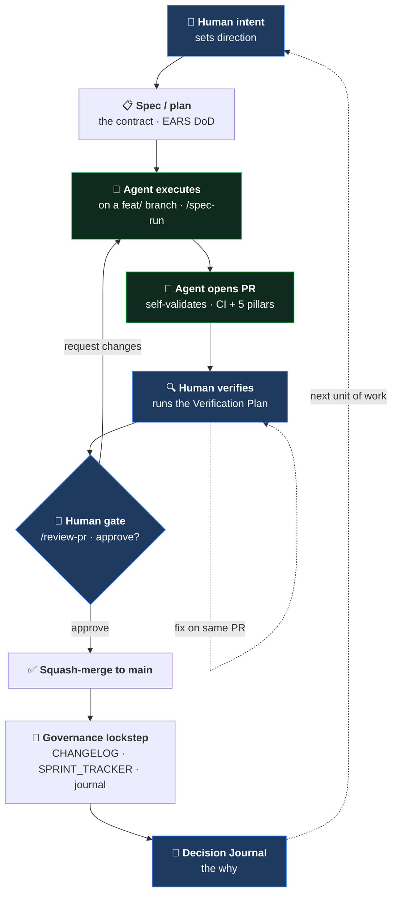

[🏠 Cetana Labs](../../README.md) / [📚 Docs](../README.md) / Guides / **AIDLC Guide**

# Cetana Labs — AIDLC Guide (AI-Driven Development Lifecycle)

> **Scope:** *what* AIDLC is and *how we practise it* here — the delivery method, the work-class routing, and the human gates. This is the conceptual entry point; the **operational step-by-step** (phases, commands, state machine) lives in [`sprint-lifecycle.md`](sprint-lifecycle.md), and the *why* in [`RFC-LAB-000-009`](../rfc/RFC-LAB-000-009-sprint-lifecycle-aidlc.md).
>
> 🤝 Companion: [`ai-collaboration-model.md`](../governance/ai-collaboration-model.md) (the human/AI/gate methodology). 🛰️ For how a merge goes live, see [`release-guide.md`](release-guide.md).

---

## 1. What AIDLC is

**AI-Driven Development Lifecycle** is how a unit of work travels from a human intent to merged, governed code with AI agents doing the execution and a human gating every merge.

> **The principle:** the human sets direction and gates every merge; AI agents execute, validate, and surface trade-offs. Decisions are the human's; execution is AI-accelerated; nothing reaches `main` without a human-approved, CI-gated PR.

It is built on **Kiro-native** features (Specs, Autonomous mode) — not a homegrown workflow — and it is dogfooded in this repo: a control plane evolving into a governed web app via RFCs and CI-gated PRs, every decision recorded.

## 2. The loop

- **Contract:** for delegated/agent work, a **Kiro Spec** (`requirements.md` EARS acceptance criteria = Definition of Done, `design.md`, `tasks.md`). For solo lead-pairing, a lighter ask.
- **Merge-first ordering:** the Spec merges to `main` *before* the first `/spec-run` — that is what lets `/spec-run` be a clean one-liner (the runner reads the Spec from `main`).
- **Two human gates:** approve the Spec merge, and the final approve-&-squash-merge. Nothing crosses to `main` without you.
- **Two loop-backs:** verification finds issues (fixed on the same PR, Single-PR rule) and review requests changes (iterate on the PR).

The **operational detail** — the five phases, the exact commands, the phase-aware guards, and the state machine — is in [`sprint-lifecycle.md`](sprint-lifecycle.md). This guide is the *concept*; that guide is the *runbook*.

## 3. Who executes — the surfaces (RFC-LAB-000-014)

AIDLC is defined by **executor role**, not named people, so it scales as developers and agents onboard. Cetana Labs runs a **cost-first, two-executor** model:

| Surface | Role | When |
| :--- | :--- | :--- |
| **KiroCrew** | **Operator** (stateful) | Brainstorm, plan, author RFCs/Specs, governance ops, PR review, persistent per-project memory. **Never merges.** |
| **Google Antigravity** | **Primary executor** (cost-first default) | Routine / mechanical / docs-skills / low-risk builds — executes the Spec's `tasks.md` directly. Free (AI Pro). |
| **Kiro IDE** | **Escalation executor** (budgeted) | Complex / high-stakes / deep-codebase / Kiro-native-dependent builds. Escalate with a one-line reason. |
| **Kiro Web** | **Stateless fallback** | Throwaway brainstorm with no persistent memory; no-install access; config-sync parity. |

- **Routing rule:** default a build to **Antigravity** (cost-first); **escalate to Kiro IDE** only with a stated reason (security-sensitive, live-data, deep-codebase, Kiro-native). Every PR from **either** executor goes through `/review-pr` + the human merge gate — the gate never relaxes for the executor.
- **Clone-per-executor:** `cetana-labs-antigravity/`, `cetana-labs-kiro-ide/`, Operator in `cetana-labs/` — sync via `origin` only, never a shared working tree. Don't merge into `main` while an executor is mid-build (forces a rebase).
- **Background worker lane** (Operator-spawned, gate-free, bounded): reversible, off-protected-path specialist work (research, analysis, doc drafts, diagram data). Produces an *artifact*; the gate still decides what lands. Code destined for `main` still flows through `/spec-run` + PR + gate.

## 4. Two work classes — how a change is routed

Ceremony scales to a change's **purpose**, not its file path. This is the decision every new ask runs through first:

| Class | What it is | Path |
| :--- | :--- | :--- |
| **Sprint deliverable** | Business functionality a user exercises (a feature, a route, an auth change, an engineering change to the governance spine) | **FULL gate** — Spec (EARS DoD) → `/spec-run` → 4 automated gates → PR → `/review-pr` scorecard → Gate-5 recording → **human merge** |
| **Governance tooling / docs** | Status board, trackers, backlog, Specs, skills, runbooks, Decision Journal, **docs** | **SIMPLIFIED path** — validate-docs (+ typecheck/build if app files) → branch/push → **human fast-merge**. No scorecard, no Gate-5. |

**The test:** *could a wrong edit here ship a broken behaviour to a user or to `main`'s automation?* If yes → sprint deliverable (full gate). If it is words a human reads → governance/docs (fast-path). **When in doubt, treat it as a sprint deliverable.**

**Three invariants never relax on either path:** the human holds the merge gate · the agent never pushes `main` · validate-docs stays green.

### 4.1 Functional vs engineering vs governance — the routing in practice

| Change type | Example | Path |
| :--- | :--- | :--- |
| **Functional** (user-facing feature/behaviour) | new app route, auth change, a CRUD surface | **RGS** (if the ask is fuzzy) → backlog → **Spec** → `/spec-run` → **full gate** |
| **Engineering** (changes system behaviour but isn't a user feature) | generator rewrite, data migration, CI-pillar change | usually **Spec + full gate** (touches the governance spine — e.g. the registry inversion, BK-036) |
| **Governance tooling / docs** | guides, trackers, README, skills, RFCs | **simplified fast-path** — branch → push → human fast-merge, no scorecard |

## 5. Where requirements come from — RGS

**RGS** (`/rgs` — Requirement Gathering System) is the front of the funnel: it turns a *fuzzy product/feature ask* into a ledger-ready `INTAKE-NNN` entry that becomes a backlog item, which then becomes a Spec. See [`rgs-guide.md`](rgs-guide.md) and the [Requirements Intake register](../governance/REQUIREMENTS_INTAKE.md).

- **Use RGS** when a *new requirement* is fuzzy and needs elicitation before it can be specced.
- **Skip RGS** for maintenance of existing artifacts (a docs audit, a tracker tidy, a bug fix with a clear repro) — that is not a new requirement; routing it through RGS would be process theatre.

So the full funnel is: **fuzzy ask → `/rgs` (INTAKE) → backlog (BK) → Spec (merge-first) → `/spec-run` → verify → `/review-pr` → human merge → lockstep + Decision Journal.**

## 6. Governance guarantees (why this is trustworthy, not just fast)

- **Human gate:** every merge is human-approved (the AIDLC safety rail).
- **CI-gated:** portfolio + 5-pillar + build checks pass before merge.
- **Recorded gate verdict:** `/review-pr` posts its checklist + verdict **transactionally as a PR comment** (a recommendation, never a GitHub approving review — the human still authorises the merge), so every gate run is auditable on the artifact, not just in chat.
- **Lockstep:** CHANGELOG / BACKLOG / SPRINT_TRACKER / journal / `data/` stay synchronised (validator-enforced).
- **Auditable reasoning:** the Decision Journal records *why*, with honest failure/recovery notes.
- **Linear history:** squash-merge, branch deletion, no force-push to `main`.

---

> 🔙 Back to the [Docs Hub](../README.md) · Related: [Sprint Lifecycle (runbook)](sprint-lifecycle.md) · [AI Collaboration Model](../governance/ai-collaboration-model.md) · [RGS Guide](rgs-guide.md) · [Release Guide](release-guide.md) · [`RFC-LAB-000-009`](../rfc/RFC-LAB-000-009-sprint-lifecycle-aidlc.md) · [`RFC-LAB-000-014`](../rfc/RFC-LAB-000-014-multi-executor.md)
