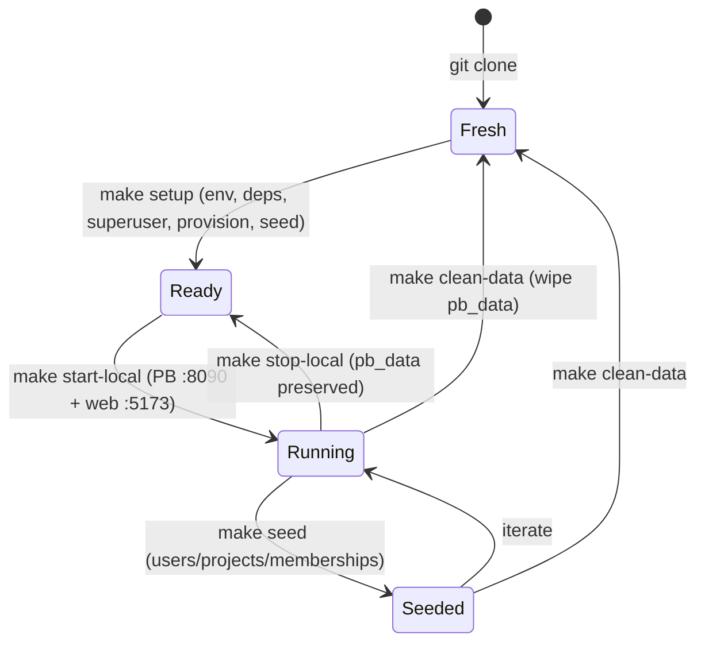

[🏠 Cetana Labs](../../README.md) / [📚 Docs](../README.md) / Guides / **Developer Guide**

# Cetana Labs — Developer Guide (Work Environment & Operations)

> **Scope:** local/cloud **setup, commands, and the Kiro Web + IDE surfaces** — how to *develop* on this repo. For how project **leads write `STATUS.md`** and run the status prompts, see [`project-owner-guide.md`](project-owner-guide.md) instead.
>
> 📋 Decision of record: [`RFC-LAB-000-007`](../rfc/RFC-LAB-000-007-work-environment.md).
> Adapted from the Nexus Pulse (`LAB-003`) Developer Guide, translated to this stack
> (PocketBase + SQLite + SvelteKit, not Postgres/Supabase).
>
> *(Renamed from `work-environment.md` — same guide, clearer name.)*

This is the authoritative guide for developing on Cetana Labs across **Kiro Web** and **Kiro IDE**.

---

## ⚡ Command Cheat-Sheet

Every command exists as both a Kiro `/command` and a `make` target (identical behavior).

| Category | Make | Slash command | What it does |
|---|---|---|---|
| **Readiness** | `make env-doctor` | `/env-doctor` | Surface-aware check: is *this* environment ready? (diagnostic only) |
| **Validate** | `make validate-local` | `/validate-local` | Full local pre-flight: Python validators + SvelteKit type-check/build |
| | `make validate-staging` | `/validate-staging` | Probe staging health (placeholder: GCP/Vercel) |
| **Local stack** | `make start-local` | `/start-local` | Start PocketBase (:8090) + SvelteKit dev (:5173) |
| | `make stop-local` | `/stop-local` | Stop dev servers (preserves data) |
| | `make status-local` | `/status-local` | Are the servers up? |
| **Setup** | `make setup` | — | One-time bootstrap: env, deps, superuser, provision, seed |
| **Data** | `make provision` | — | Create collections via API (version-robust) |
| | `make seed` | — | Provision + seed PocketBase from `data/` |
| | `make clean-data` | — | Reset local DB to a clean slate |
| **Containers** | `make pb-image` | — | Build PocketBase image (Podman-first) for staging parity |
| **Sprint** | — | `/sprint-start`, `/sprint-done` | Open / close a sprint |
| **Audit** | — | `/audit-doc`, `/audit-project` | Doc review / project health sweep |

> Run `make` (or `make help`) any time for this list.

---

## 1. Surface Roles (Kiro Web vs Kiro IDE)

Two surfaces, one repo. Use the right one for the job (`RFC-LAB-000-007` §2.1):

| Surface | Role | Do this here |
|---|---|---|
| **Kiro Web** | **Stateless** governance/docs | RFCs, sprint-tracker/backlog/changelog/journal, `data/` edits, PR review, planning, Python `scripts/`, status broadcasts |
| **Kiro IDE** (local) | **Stateful** servers/data | `/start-local`, PocketBase DB, SvelteKit UI dev, secrets/OAuth, staging deploys |

Not a hard wall — Web can edit anything, it just can't run persistent servers.

### Cloud workflow (Kiro Web) — the stateless loop

For governance/docs/scripts work, the entire loop runs in the browser with **zero local footprint** (`RFC-LAB-000-001`). `LAB-000` is a documentation + zero-dependency-Python control plane whose automation already runs in GitHub Actions:


**Preview the dashboard without a local machine:** the dashboard is static HTML generated by a script — regenerate with `python3 scripts/generate_dashboard.py`, then review it in the Kiro Web file preview, or check the deployed page (~15s after push): <https://agni-eialarasu.github.io/cetana-labs/>.

**Environment classification (for new initiatives):** classify each project's `Dev Environment` using the heuristic in [`RFC-LAB-000-001` §4](../rfc/RFC-LAB-000-001-cloud-dev-migration.md) and record it in `STATUS.md` + the registry:
- **☁️ Cloud (default)** — docs, research, static generators, CI-executed automation. `LAB-000` runs primary on **Kiro Web**; it shifts to **Codespaces** if/when it grows persistent services (db + server) — declared in `.devcontainer/`, staying fully cloud-based (the web-app + RBAC evolution, `BK-007`/`BK-008`).
- **💻 Local** — needs persistent local services, hardware (GPU/CV/edge), data-residency, or a heavyweight native toolchain.

---

## 2. Prerequisites (Kiro IDE / local)

Toolchain is **Homebrew-native** on the reference MBP work machine (nvm/pyenv shell
hooks are intentionally disabled for fast terminal startup — do **not** rely on `nvm`).

- **Python 3.11+** (governance scripts are zero-dependency; no venv needed). `uv` is the standard if deps are ever added.
- **Node** & **pnpm 10.27** via Homebrew (`/opt/homebrew/bin/node`, `/opt/homebrew/bin/pnpm`). `package.json` pins `packageManager: pnpm@10.27.0`; Corepack keeps it consistent. No per-project Node switching.
- **PocketBase >= 0.23** — system binary via Homebrew (`pb`), or fetched by `.devcontainer/setup-pocketbase.sh` in cloud/CI.
- **Podman** (preferred; `pod-start`/`pod-stop` manage the VM) or Docker context — only for containerized workflows; local dev runs the `pb` binary directly.

Kiro Web needs none of the server tooling — it's for stateless work.

---

## 3. Initial Setup (first time, local)

**One command** (recommended) — idempotent bootstrap with sensible local defaults:

```bash
make setup            # env + web deps + PocketBase superuser + schema hint + seed
# equivalently: bash scripts/setup-local.sh
```
Defaults: superuser `admin@cetana.local` / `CetanaLocal2026!` (override via `PB_ADMIN_EMAIL` / `PB_ADMIN_PASSWORD` env or `.env`). The script prints the Admin UI import step for `pb_schema.json`, then offers to seed from `data/`. Re-runnable any time.

<details><summary>Manual steps (if you prefer)</summary>

```bash
cp .env.example .env                                   # set PB_ADMIN_*
cd app/web && pnpm install --frozen-lockfile && cd ../..
pb superuser upsert admin@cetana.local 'CetanaLocal2026!'   # >= 8 chars
pb --version                                            # confirm >= 0.23
make env-doctor
```
</details>

---

## 4. Starting the Local Stack

The `make` targets move the local stack between states:



Two modes, mirroring Nexus Pulse's State A / State B:

### State A — Clean slate (recommended default)
```bash
make start-local
```
Starts PocketBase (`:8090`, admin `/_/`) and SvelteKit dev (`:5173`) with an empty DB — good for onboarding/intake flows.

### State B — Seeded from `data/`
```bash
make start-local            # in one terminal (PB + web)
# then, with PB_ADMIN_* set in .env:
make seed                    # provisions collections (API) + seeds users/projects/memberships
```
`make seed` runs `pb_provision.py` (creates collections via the API — version-robust, no manual schema import) then `pb_import.py` (seeds the 3 users, 6 projects, memberships from the relational masters, `RFC-LAB-000-002`). `make setup` does this end-to-end on first run.

### Stop
```bash
make stop-local              # frees :5173 and :8090; pb_data preserved
```

---

## 5. Database & Auth (local)

| Parameter | Value |
|---|---|
| PocketBase URL | `http://127.0.0.1:8090` |
| Admin UI | `http://127.0.0.1:8090/_/` |
| Data file | `app/pocketbase/pb_data/` (SQLite, gitignored) |
| Superuser | from `.env` (`PB_ADMIN_EMAIL` / `PB_ADMIN_PASSWORD`) |

> ⚠️ **The `pb_data` location gotcha (learned the hard way — `RFC-LAB-000-008` M3–M4).**
> PocketBase resolves `pb_data` **relative to its current working directory**. The
> **one canonical location is `app/pocketbase/pb_data`** — always start the backend so it
> lands there, i.e. **`make start-local` / `make pb-serve`** (they `cd app/pocketbase`
> first), or `pocketbase serve --dir app/pocketbase/pb_data` from the repo root. If you
> `pocketbase serve` from some *other* directory (e.g. `/opt/homebrew/bin`), it silently
> creates a **separate, empty `pb_data` there** — your seed, OAuth config, and schema all
> go to the wrong place, and `make start-local` then serves an empty backend. All backend
> state (superuser, collections, seed, **OAuth provider config**) lives inside whichever
> `pb_data` is active, so a mismatch looks like "everything vanished."
>
> **Symptoms:** anon reads return `404 "Missing collection context"`; superuser auth
> `400`; the dashboard is empty though you "just seeded it."
> **Recovery (rebuild the canonical instance):**
> ```bash
> make stop-local                                   # kill any stray servers first
> pocketbase superuser upsert "$PB_ADMIN_EMAIL" "$PB_ADMIN_PASSWORD"   # run from app/pocketbase/
> make start-local                                  # serves app/pocketbase/pb_data
> make seed                                          # provision + seed the canonical dir
> ```
> Then re-add the GitHub OAuth provider once (§5.1) — the OAuth **client secret is not
> committed and does not migrate between data dirs**, so a fresh `pb_data` needs it re-entered.
> **Rule of thumb:** never `pocketbase serve` from a raw shell in an arbitrary directory;
> use the `make` targets so the data dir is always canonical.

**Test personas & RBAC (forward — Phase 3, `RFC-LAB-000-006`):** once GitHub OAuth + roles land, personas map to the `memberships` roles (`owner`/`lead`/`contributor`/`reviewer`/`stakeholder`). Provisioning steps will be added here when auth is built.

### 5.1 GitHub OAuth setup (PocketBase v0.40+)

> **Version note (verified on v0.40.4):** OAuth2 providers are configured **per auth collection**, *not* in a global "Settings → Auth providers" menu (that path was removed after PocketBase ≤0.22). This tripped us once — documented here so it doesn't again. Applies to local dev **and** the deployed backend (`RFC-LAB-000-011`).

**1. Create a GitHub OAuth app** — GitHub → Settings → Developer settings → **OAuth Apps** → New OAuth App:
- **Homepage URL:** `http://localhost:5173` (local) / your Vercel URL (deployed).
- **Authorization callback URL:** `http://127.0.0.1:8090/api/oauth2-redirect` (local) / your GCP PocketBase URL + `/api/oauth2-redirect` (deployed).
- Copy the **Client ID** and generate a **Client Secret**.

**2. Enable it in PocketBase** — admin UI (`http://127.0.0.1:8090/_/`):
- **Collections → `users` → edit (gear) → Options tab → OAuth2 → Enable → `+ Add provider` → GitHub** → paste Client ID + Secret → Save.
- (This is where the earlier "Settings → Auth providers" instruction now lives.)

**3. Secrets discipline (`RFC-LAB-000-011` §4.3):** the client id/secret live in the **PocketBase admin**, never in the repo. The frontend needs only `VITE_PB_URL`. For the deployed backend, secrets go in the VM env / GCP Secret Manager; update the callback URL to the production PocketBase domain.

**4. Superuser escape hatch:** the PB superuser (admin UI) login is independent of OAuth — if OAuth is misconfigured, you are not locked out.

**5. Ownership linking — how owner-writes resolve (M3–M4, learned in verification).** PocketBase creates a **separate auth record per GitHub OAuth identity**; it does *not* reuse a pre-seeded `users` row, and `mappedFields` can't populate a custom field. So an OAuth login's record starts with an **empty `github_handle`**, and its record `id` differs from the seeded owner the `projects.owner` relation points to. Two pieces make owner-writes work:
- **`pb_hooks/oauth_github_handle.pb.js`** — an `onRecordAuthWithOAuth2Request` hook copies the GitHub login into `github_handle` on sign-in (idempotent; only when empty). *(Hooks load from `app/pocketbase/pb_hooks/` at startup — another reason to start PB from `app/pocketbase/`; they're committed, unlike `pb_data`.)*
- **`projects.updateRule` matches on handle, not id:** `@request.auth.id != "" && @request.auth.github_handle != "" && owner.github_handle = @request.auth.github_handle`. This is environment-robust (record ids change per seed; handles don't) and matches how the UI already resolves ownership.
- **Existing OAuth records** created *before* the hook won't have a handle — either sign out/in again (the hook backfills) or set `github_handle` once in the admin. A brand-new local `pb_data` needs neither (the hook runs on first sign-in).

---

## 6. Full Clean Reset

```bash
# Fast: wipe local DB data, keep schema/binary
make clean-data && make seed

# Deep (container path): rebuild the PocketBase image
podman build -t cetana-pocketbase -f app/pocketbase/Containerfile app/pocketbase   # or: docker build ...
```

---

## 7. Config Sync — Personal vs Project (one-way)

- **Project config** (`.kiro/skills/`, `.kiro/steering/`) is **committed** → travels with the repo to both surfaces automatically. No action needed.
- **Personal config** (`~/.kiro/skills/` — `/sign-in`, `/sign-off`, `/session-save`, `/session-resume`) is **local**. Kiro Web can't read it directly.
  - **Local `~/.kiro/` is the source of truth.** After editing, push via **Kiro Web → Settings → Sync** (one-way local→cloud). Web edits do NOT flow back.
  - A temporary `my-kiro` symlink to `~/.kiro` (for viewing in the IDE) is gitignored — never commit it.

---

## 8. Development Process & PR Protocol

Governed by [`RFC-LAB-000-004`](../rfc/RFC-LAB-000-004-branching-model.md) (hybrid, path-scoped):
- **App code / `data/` / migrations** → feature branch → PR → green CI → squash-merge to `main`.
- **Governance / docs** → may fast-path to `main`.
- Always run `make validate-local` (`/validate-local`) before opening a PR or `/sprint-done`.
- Never force-push `main`; roll back via revert PR.

---

## 9. Deployment — Production (Vercel + Railway)

> Decision of record: [`RFC-LAB-000-011`](../rfc/RFC-LAB-000-011-deployment.md) (amended, Entry 010 — **Vercel frontend + Railway backend**, superseding the earlier GCP-VM plan). Delivered by MVP **M5** (`TSK-054`, `BK-011`). This is the reusable runbook for a production deploy / a new environment.
>
> **Architecture:** SvelteKit static SPA → **Vercel**; PocketBase (container + SQLite on a persistent volume, managed HTTPS) → **Railway**. The SPA reads `VITE_PB_URL` (the Railway URL); OAuth + secrets live on Railway; **no secret is committed**.
>
> **Sequencing (RFC-011 §5):** backend (Railway) **first** → frontend (Vercel) → verify live → **then** retire the GitHub-Pages stopgap. Never remove the classic dashboard before the deployed app is verified.

### 9.1 Backend — PocketBase on Railway (do first)
1. **Create the service** from the repo's `app/pocketbase/Containerfile` (Railway → New → Deploy from repo / Dockerfile).
2. **Attach a persistent volume mounted at the container's `pb_data/`** — *this is the crux; without it a redeploy wipes the database.*
3. Set Railway **service env**: `PB_ADMIN_EMAIL`, `PB_ADMIN_PASSWORD` (superuser — admin escape hatch). OAuth secrets come in §9.3.
4. Deploy; note the **managed HTTPS URL** (`https://<app>.up.railway.app`). The `pb_hooks/oauth_github_handle.pb.js` hook ships in the image.

### 9.2 Seed collections against Railway (first time)
Point the local scripts at the Railway URL (env passed on the command line — nothing committed):
```bash
PB_URL=https://<app>.up.railway.app \
PB_ADMIN_EMAIL=... PB_ADMIN_PASSWORD=... \
python3 scripts/pb_provision.py --apply     # collections + rules (incl. owner updateRule)
PB_URL=https://<app>.up.railway.app \
PB_ADMIN_EMAIL=... PB_ADMIN_PASSWORD=... \
python3 scripts/pb_import.py --apply         # 6 projects / 3 users / memberships
```
Confirm: `curl https://<app>.up.railway.app/api/collections/projects/records` returns 6 projects.

### 9.3 Production GitHub OAuth
1. In the GitHub OAuth app (or a dedicated prod app), set **Authorization callback URL** → `https://<app>.up.railway.app/api/oauth2-redirect`.
2. On the **Railway** PocketBase admin (`https://<app>.up.railway.app/_/`), enable OAuth2 on the `users` collection and add GitHub (client id + secret) — same per-collection path as §5.1. Secrets stay in Railway/PB, never in the repo.

### 9.4 Frontend — SvelteKit on Vercel
1. Connect the repo; set the Vercel project **root to `app/web`** (SvelteKit `adapter-static`).
2. Set the Vercel env var **`VITE_PB_URL = https://<app>.up.railway.app`** (the Railway URL).
3. Deploy; note the **`https://<app>.vercel.app`** URL. Vercel gives production + per-PR previews.

### 9.5 Verify live, then retire Pages
- Verify on the live URLs: backend seeded, frontend reads Railway, prod sign-in, owner-write persists, **non-owner denied** (RBAC), **data survives a redeploy** (the volume).
- **Only after** that passes, retire the GitHub-Pages stopgap: remove `docs/index.html`, `.github/workflows/deploy-pages.yml`, `scripts/generate_dashboard.py` (grep first — only if unused elsewhere), and fix any dangling references.

### 9.6 Backups (starter)
Use Railway **volume snapshots** to start; a scheduled `pb_data` export to object storage is the hardening follow-up (RFC-011 OQ).

> `/status-staging` and `/validate-staging` remain placeholders — there is no separate staging tier for the MVP; production is the first deployed environment.
