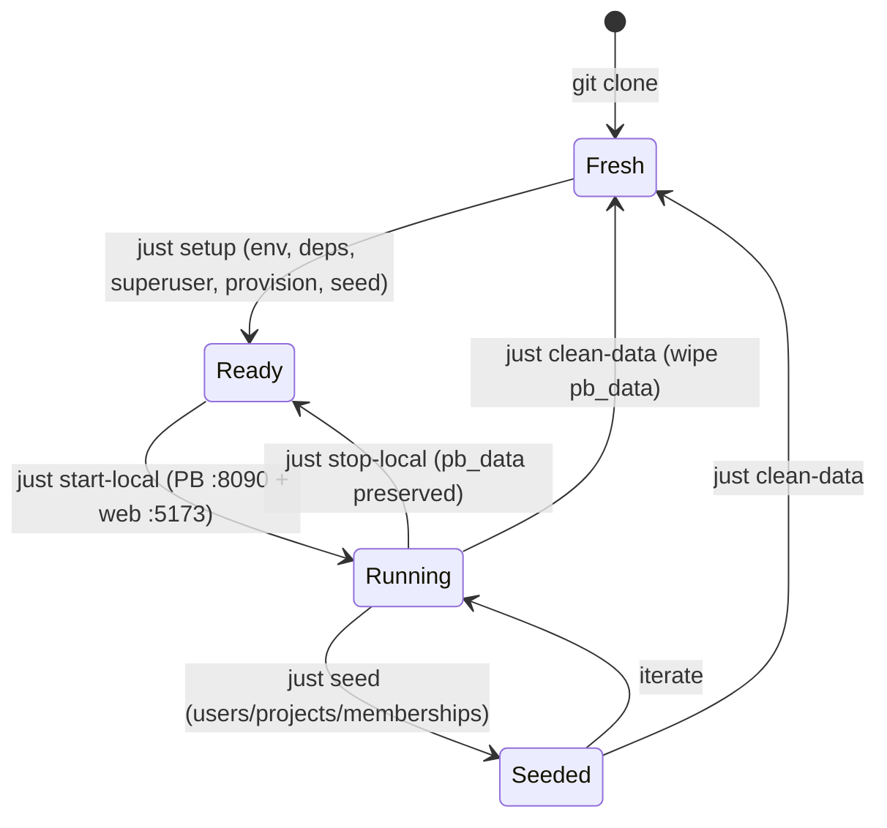

[🏠 Cetana Labs](../../README.md) / [📚 Docs](../README.md) / Guides / **Developer Guide**

# Cetana Labs — Developer Guide (Work Environment & Operations)

> **Scope:** local/cloud **setup, commands, and the Kiro Web + IDE surfaces** — how to *develop* on this repo. For how project **leads write `STATUS.md`** and run the status prompts, see [`project-owner-guide.md`](project-owner-guide.md) instead.
>
> 📋 Decision of record: [`RFC-LAB-000-007`](../rfc/RFC-LAB-000-007-work-environment.md).
> Adapted from the Nexus Pulse (`LAB-003`) Developer Guide, translated to this stack
> (PocketBase + SQLite + SvelteKit, not Postgres/Supabase).
>
> *(Renamed from `work-environment.md` — same guide, clearer name.)*

This is the authoritative guide for developing on Cetana Labs across **Kiro Web** and **Kiro IDE**.

---

## ⚡ Command Cheat-Sheet

Cetana Labs standardizes on **`just`** (`justfile`) as the task runner, sharing a common cross-repo core with Nexus Pulse (Director decision: one shared command vocabulary across Agni repos). Run `just` or `just --list` any time for the full cheat-sheet.

A thin **`Makefile` forwarding shim** is maintained for one sprint to preserve backward compatibility (`make <target>` forwards to `just <target>`).

Every command exists as both a Kiro `/command` and a `just` recipe (identical behavior).

| Category | Just recipe | Make (shim) | Slash command | What it does |
|---|---|---|---|---|
| **Help** | `just` / `just help` | `make help` | — | Show recipe cheat-sheet (`just --list`) |
| **Readiness** | `just env-doctor` | `make env-doctor` | `/env-doctor` | Surface-aware check: is *this* environment ready? (diagnostic only) |
| **Validate** | `just validate-local` | `make validate-local` | `/validate-local` | Full local pre-flight: Python validators + SvelteKit type-check/build |
| | `just validate-staging` | `make validate-staging` | `/validate-staging` | Probe staging health (Railway/Vercel) |
| **Local stack** | `just start-local` | `make start-local` | `/start-local` | Start PocketBase (:8090) + SvelteKit dev (:5173) |
| | `just stop-local` | `make stop-local` | `/stop-local` | Stop dev servers (preserves data) |
| | `just status-local` | `make status-local` | `/status-local` | Are the servers up? |
| **Setup** | `just setup` | `make setup` | — | One-time bootstrap: env, deps, superuser, provision, seed |
| **Data** | `just provision` | `make provision` | — | Create collections via API (version-robust) |
| | `just seed` | `make seed` | — | Provision + seed PocketBase from `data/` |
| | `just clean-data` | `make clean-data` | — | Reset local DB to a clean slate |
| **Containers** | `just pb-image` | `make pb-image` | — | Build PocketBase image (Podman-first) for staging parity |
| **Deploy** | *(merge to `main`)* | — | — | **Normal staging deploy is AUTOMATIC on merge** — both tiers to the single reference env (§9A.0) |
| | `just deploy-adhoc ENV=<file>` | `make deploy-adhoc ENV=<file>` | `/deploy-adhoc` | On-demand deploy to an arbitrary instance (throwaway/other) — a dev tool, not a stage (§9A.0) |
| | `just deploy-staging` | `make deploy-staging` | — | Manual *override* re-deploy of the staging env (not "the pipeline"; §9A.0) |
| | `just verify-bundle` | `make verify-bundle` | — | Assert the built bundle baked in the expected backend URL (§9A.3) |
| | `just verify-live-frontend URL=<live>` | `make verify-live-frontend URL=<live>` | — | Assert the LIVE Vercel site serves the expected backend (post-deploy ops-alert, §9A.6) |
| **Sprint** | — | — | `/sprint-start`, `/sprint-done` | Open / close a sprint |
| **Audit** | — | — | `/audit-doc`, `/audit-project` | Doc review / project health sweep |

> Run `just` (or `just --list`, or `make help`) any time for this list.

---

## 1. Surface Roles (Kiro Web vs Kiro IDE)

Two surfaces, one repo. Use the right one for the job (`RFC-LAB-000-007` §2.1):

| Surface | Role | Do this here |
|---|---|---|
| **Kiro Web** | **Stateless** governance/docs | RFCs, sprint-tracker/backlog/changelog/journal, `data/` edits, PR review, planning, Python `scripts/`, status broadcasts |
| **Kiro IDE** (local) | **Stateful** servers/data | `/start-local`, PocketBase DB, SvelteKit UI dev, secrets/OAuth, staging deploys |

Not a hard wall — Web can edit anything, it just can't run persistent servers.

### Cloud workflow (Kiro Web) — the stateless loop

For governance/docs/scripts work, the entire loop runs in the browser with **zero local footprint** (`RFC-LAB-000-001`). `LAB-000` is a documentation + zero-dependency-Python control plane whose automation already runs in GitHub Actions:


**The live app:** the portfolio is the deployed **Sleek UI** (SvelteKit → Vercel, reading PocketBase → Railway) — see §9 Deployment. *(The old build-time GitHub-Pages dashboard, `docs/index.html` + `generate_dashboard.py`, was retired at M5, `RFC-LAB-000-011`.)*

**Environment classification (for new initiatives):** classify each project's `Dev Environment` using the heuristic in [`RFC-LAB-000-001` §4](../rfc/RFC-LAB-000-001-cloud-dev-migration.md) and record it in `STATUS.md` + the registry:
- **☁️ Cloud (default)** — docs, research, static generators, CI-executed automation. `LAB-000` runs primary on **Kiro Web**; it shifts to **Codespaces** if/when it grows persistent services (db + server) — declared in `.devcontainer/`, staying fully cloud-based (the web-app + RBAC evolution, `BK-007`/`BK-008`).
- **💻 Local** — needs persistent local services, hardware (GPU/CV/edge), data-residency, or a heavyweight native toolchain.

---

## 2. Prerequisites (Kiro IDE / local)

Toolchain is **Homebrew-native** on the reference MBP work machine (nvm/pyenv shell
hooks are intentionally disabled for fast terminal startup — do **not** rely on `nvm`).

- **Python 3.11+** (governance scripts are zero-dependency; no venv needed). `uv` is the standard if deps are ever added.
- **Node** & **pnpm 10.27** via Homebrew (`/opt/homebrew/bin/node`, `/opt/homebrew/bin/pnpm`). `package.json` pins `packageManager: pnpm@10.27.0`; Corepack keeps it consistent. No per-project Node switching.
- **PocketBase >= 0.23** — system binary via Homebrew (`pb` / `pocketbase`, on PATH at `/opt/homebrew/bin`), or fetched by `.devcontainer/setup-pocketbase.sh` in cloud/CI.
- **Podman** (preferred; `pod-start`/`pod-stop` manage the VM) or Docker context — only for containerized workflows; local dev runs the `pb` binary directly.

Kiro Web needs none of the server tooling — it's for stateless work.

> ### Local Dev — DX quick reference (recurring gotchas, all handled)
> These bit us during v0.14.0 local testing; the fixes are in the repo now, but know them:
> 1. **PocketBase is a PATH binary, not `./pocketbase`.** Install is Homebrew (`brew install pocketbase` → `/opt/homebrew/bin/pocketbase`). The repo has **no committed `pocketbase` file** (gitignored). Never run `./pocketbase` or `cd app/pocketbase && ./pocketbase` — use `just start-local` / `just setup` (they resolve the PATH binary) or `pocketbase serve --dir app/pocketbase/pb_data`.
> 2. **`just seed` needs `.env` — now auto-loaded.** `set dotenv-load := true` in the `justfile` sources the root `.env` (`PB_ADMIN_EMAIL`/`PB_ADMIN_PASSWORD`) into every recipe. If you call PocketBase/Python directly outside a recipe: `set -a && source .env && set +a` first.
> 3. **Always pin `--dir app/pocketbase/pb_data`** on any raw `pocketbase serve` / `superuser` from the repo root — otherwise PocketBase writes a **stray `pb_data/` at the root** (the recurring `git status` noise). The `just` recipes and `scripts/setup-local.sh` do this for you.
> 4. **OAuth: browse at `http://localhost:5173`** (not `127.0.0.1`) to match the registered GitHub callback `http://localhost:5173/oauth/callback` — a host mismatch passes the authorize step but 400s the token exchange (§5.1).
>
> **Fastest clean start:** `just setup` (end-to-end: superuser + schema + seed, PATH binary, canonical dir), then `just start-local`.

---

## 3. Initial Setup (first time, local)

**One command** (recommended) — idempotent bootstrap with sensible local defaults:

```bash
just setup            # env + web deps + PocketBase superuser + schema hint + seed (or: make setup)
# equivalently: bash scripts/setup-local.sh
```
Defaults: superuser `admin@cetana.local` / `CetanaLocal2026!` (override via `PB_ADMIN_EMAIL` / `PB_ADMIN_PASSWORD` env or `.env`). The script prints the Admin UI import step for `pb_schema.json`, then offers to seed from `data/`. Re-runnable any time.

<details><summary>Manual steps (if you prefer)</summary>

```bash
cp .env.example .env                                   # set PB_ADMIN_*
cd app/web && pnpm install --frozen-lockfile && cd ../..
pb superuser upsert admin@cetana.local 'CetanaLocal2026!'   # >= 8 chars
pb --version                                            # confirm >= 0.23
just env-doctor
```
</details>

---

## 4. Starting the Local Stack

The `just` recipes (or `make` shim) move the local stack between states:



Two modes, mirroring Nexus Pulse's State A / State B:

### State A — Clean slate (recommended default)
```bash
just start-local
```
Starts PocketBase (`:8090`, admin `/_/`) and SvelteKit dev (`:5173`) with an empty DB — good for onboarding/intake flows.

### State B — Seeded from `data/`
```bash
just start-local            # in one terminal (PB + web)
# then, with PB_ADMIN_* set in .env:
just seed                   # provisions collections (API) + seeds users/projects/memberships
```
`just seed` runs `pb_provision.py` (creates collections via the API — version-robust, no manual schema import) then `pb_import.py` (seeds the 3 users, 6 projects, memberships from the relational masters, `RFC-LAB-000-002`). `just setup` does this end-to-end on first run.

### Stop
```bash
just stop-local             # frees :5173 and :8090; pb_data preserved
```

---

## 5. Database & Auth (local)

| Parameter | Value |
|---|---|
| PocketBase URL | `http://127.0.0.1:8090` |
| Admin UI | `http://127.0.0.1:8090/_/` |
| Data file | `app/pocketbase/pb_data/` (SQLite, gitignored) |
| Superuser | from `.env` (`PB_ADMIN_EMAIL` / `PB_ADMIN_PASSWORD`) |

> ⚠️ **The `pb_data` location gotcha (learned the hard way — `RFC-LAB-000-008` M3–M4).**
> PocketBase resolves `pb_data` **relative to its current working directory**. The
> **one canonical location is `app/pocketbase/pb_data`** — always start the backend so it
> lands there, i.e. **`just start-local` / `just pb-serve`** (they `cd app/pocketbase`
> first), or `pocketbase serve --dir app/pocketbase/pb_data` from the repo root. If you
> `pocketbase serve` from some *other* directory (e.g. `/opt/homebrew/bin`), it silently
> creates a **separate, empty `pb_data` there** — your seed, OAuth config, and schema all
> go to the wrong place, and `just start-local` then serves an empty backend. All backend
> state (superuser, collections, seed, **OAuth provider config**) lives inside whichever
> `pb_data` is active, so a mismatch looks like "everything vanished."
>
> **Symptoms:** anon reads return `404 "Missing collection context"`; superuser auth
> `400`; the dashboard is empty though you "just seeded it."
> **Recovery (rebuild the canonical instance):**
> ```bash
> just stop-local                                  # kill any stray servers first
> pocketbase superuser upsert "$PB_ADMIN_EMAIL" "$PB_ADMIN_PASSWORD" --dir app/pocketbase/pb_data   # PATH binary; --dir avoids the CWD trap
> just start-local                                 # serves app/pocketbase/pb_data
> just seed                                        # provision + seed the canonical dir
> ```
> Then re-add the GitHub OAuth provider once (§5.1) — the OAuth **client secret is not
> committed and does not migrate between data dirs**, so a fresh `pb_data` needs it re-entered.
> **Rule of thumb:** never `pocketbase serve` from a raw shell in an arbitrary directory;
> use the `just` recipes so the data dir is always canonical.

**Test personas & RBAC (forward — Phase 3, `RFC-LAB-000-006`):** once GitHub OAuth + roles land, personas map to the `memberships` roles (`owner`/`lead`/`contributor`/`reviewer`/`stakeholder`). Provisioning steps will be added here when auth is built.

### 5.1 GitHub OAuth setup (PocketBase v0.40+)

> **Version note (verified on v0.40.4):** OAuth2 providers are configured **per auth collection**, *not* in a global "Settings → Auth providers" menu (that path was removed after PocketBase ≤0.22). This tripped us once — documented here so it doesn't again. Applies to local dev **and** the deployed backend (`RFC-LAB-000-011`).

**1. Create a GitHub OAuth app** — GitHub → Settings → Developer settings → **OAuth Apps** → New OAuth App:
- **Homepage URL:** `http://localhost:5173` (local) / your Vercel URL (deployed).
- **Authorization callback URL:** `http://localhost:5173/oauth/callback` (local) / your Vercel URL + `/oauth/callback` (deployed). This is the **frontend** callback the BK-018 redirect flow returns to (`${window.location.origin}/oauth/callback` — `app/web/src/lib/auth.svelte.ts`), **NOT** PocketBase's `/api/oauth2-redirect` (that direct-provider endpoint was dropped in BK-018 because PB's `/api/realtime` channel breaks behind Railway's proxy — `RFC-LAB-000-011` §4.5).
  - ⚠️ **Host-consistency footgun:** GitHub treats `localhost` and `127.0.0.1` as **different hosts**, and it requires the token-exchange `redirect_uri` to match the authorize step exactly. Browse the app and register the callback on the **same** host (use `http://localhost:5173` for both). A `localhost`↔`127.0.0.1` mismatch passes the authorize step but fails the token exchange with **`400 Failed to fetch OAuth2 token`**.
- Copy the **Client ID** and generate a **Client Secret**.

**2. Enable it in PocketBase** — admin UI (`http://127.0.0.1:8090/_/`):
- **Collections → `users` → edit (gear) → Options tab → OAuth2 → Enable → `+ Add provider` → GitHub** → paste Client ID + Secret → Save.
- (This is where the earlier "Settings → Auth providers" instruction now lives.)

**3. Secrets discipline (`RFC-LAB-000-011` §4.3):** the client id/secret live in the **PocketBase admin**, never in the repo. The frontend needs only `VITE_PB_URL`. For the deployed backend, secrets go in the VM env / GCP Secret Manager; update the callback URL to the production PocketBase domain.

**4. Superuser escape hatch:** the PB superuser (admin UI) login is independent of OAuth — if OAuth is misconfigured, you are not locked out.

**5. Ownership linking — how owner-writes resolve (M3–M4, learned in verification).** PocketBase creates a **separate auth record per GitHub OAuth identity**; it does *not* reuse a pre-seeded `users` row, and `mappedFields` can't populate a custom field. So an OAuth login's record starts with an **empty `github_handle`**, and its record `id` differs from the seeded owner the `projects.owner` relation points to. Two pieces make owner-writes work:
- **`pb_hooks/oauth_github_handle.pb.js`** — an `onRecordAuthWithOAuth2Request` hook copies the GitHub login into `github_handle` on sign-in (idempotent; only when empty). *(Hooks load from `app/pocketbase/pb_hooks/` at startup — another reason to start PB from `app/pocketbase/`; they're committed, unlike `pb_data`.)*
- **`projects.updateRule` matches on handle, not id:** `@request.auth.id != "" && @request.auth.github_handle != "" && owner.github_handle = @request.auth.github_handle`. This is environment-robust (record ids change per seed; handles don't) and matches how the UI already resolves ownership.
- **Existing OAuth records** created *before* the hook won't have a handle — either sign out/in again (the hook backfills) or set `github_handle` once in the admin. A brand-new local `pb_data` needs neither (the hook runs on first sign-in).

### 5.2 App-Level Settings Pattern (`RFC-LAB-000-013` / `BK-012`)

App settings are runtime-configurable values read by the SPA (starting with `app_name` and `app_description`), serving as the foundation for `BK-013` branding and white-labeling:

1. **Collection (`settings`):** Key/value store with fields `key` (text, unique, required), `value` (text), `type` (select: `string`|`number`|`boolean`|`url`), and `group` (text, optional). Declared in `scripts/generate_pb_schema.py`, seeded via `data/settings.json` + `data/settings.schema.json`.
2. **Typed Accessor Façade (`app/web/src/lib/settings.ts`):** Eagerly loads settings once and exposes typed getters with hardcoded defaults:
   - `settings.appName(): string` (default: `'Cetana Labs Control Hub'`)
   - `settings.appDescription(): string` (default: `'Protocol Engine'`)
   - Absent or empty keys return the hardcoded default (resilience: no crash, no blanking).
   - Values are cast per `type`; callers never touch raw database rows.
3. **How to add a new setting:**
   - Add a seed entry in `data/settings.json`: `{"key": "my_setting", "value": "val", "type": "string", "group": "general"}`.
   - Add a default and typed getter in `app/web/src/lib/settings.svelte.ts`:
     ```ts
     mySetting(): string { return this.get('my_setting', DEFAULT_VALUE); }
     ```
   - Consume anywhere via `settings.mySetting()`.
4. **RBAC Posture:**
   - `listRule` / `viewRule`: **public** (`""`) so branding renders pre-auth on public dashboards.
   - `createRule` / `updateRule` / `deleteRule`: **superuser-only** (`null`). Non-superuser writes are denied. General admin write paths require the admin role (`BK-014`).
5. **Logo Settings (`BK-013`):** `logo_icon_url`, `logo_small_url`, and `logo_medium_url` are seeded with empty string defaults (`type: "url"`, `group: "branding"`). When empty, the app renders text branding only. Settings must strictly contain non-sensitive configuration — **never store secrets in settings**.

### 5.3 White-Labeling a Deploy (`BK-013` / `RFC-LAB-000-011`)

A per-client or white-labeled deployment can customize the app name, description, and logo set **without a code change**:

1. **Branding Settings Available:**
   - `app_name`: String (default: `'Cetana Labs Control Hub'`). Rendered in page titles, header branding, and dashboard masthead.
   - `app_description`: String (default: `'Protocol Engine'`). Rendered in masthead subtitle and metadata.
   - `logo_small_url`: URL reference to an asset (e.g., `/brand/logo.svg` or hosted CDN). Displayed in header navigation and dashboard masthead.
   - `logo_icon_url`: URL reference to a square icon asset. Used as fallback icon in headers or compact footers.
   - `logo_medium_url`: URL reference to a medium-sized logo asset.

2. **Two Deployment Paths:**
   - **Live PocketBase Path (`VITE_PB_SOURCE=auto` or `pocketbase`):**
     Update the records in the `settings` collection directly via PocketBase Admin UI (`/_/`) or seed them via `scripts/pb_import.py --apply`. The SPA fetches settings at runtime on load.
   - **Static Snapshot Path (`VITE_PB_SOURCE=snapshot`):**
     Edit `data/settings.json`, run `node app/web/scripts/copy-data.js` (or `pnpm build`), and deploy the static build. No database connection required.

3. **Data Change, Not a Code Change:**
   Branding is purely data-driven. The accessor (`SettingsAccessor`) reads settings with built-in fallbacks. When logo URLs are unset or empty, the UI displays text branding only with zero broken images and zero layout shift.

---

## 6. Full Clean Reset

```bash
# Fast: wipe local DB data, keep schema/binary
just clean-data && just seed   # (or: make clean-data && make seed)

# Deep (container path): rebuild the PocketBase image
podman build -t cetana-pocketbase -f app/pocketbase/Containerfile app/pocketbase   # or: docker build ...
```

---

## 7. Config Sync — Personal vs Project (one-way)

- **Project config** (`.kiro/skills/`, `.kiro/steering/`) is **committed** → travels with the repo to both surfaces automatically. No action needed.
- **Personal config** (`~/.kiro/skills/` — `/sign-in`, `/sign-off`, `/session-save`, `/session-resume`) is **local**. Kiro Web can't read it directly.
  - **Local `~/.kiro/` is the source of truth.** After editing, push via **Kiro Web → Settings → Sync** (one-way local→cloud). Web edits do NOT flow back.
  - A temporary `my-kiro` symlink to `~/.kiro` (for viewing in the IDE) is gitignored — never commit it.

---

## 8. Development Process & PR Protocol

Governed by [`RFC-LAB-000-004`](../rfc/RFC-LAB-000-004-branching-model.md) (hybrid, path-scoped):
- **App code / `data/` / migrations** → feature branch → PR → green CI → squash-merge to `main`.
- **Governance / docs** → may fast-path to `main`.
- Always run `just validate-local` (`/validate-local`) before opening a PR or `/sprint-done`.
- Never force-push `main`; roll back via revert PR.

> ### Who pushes `main` (the "`main` is 1 ahead" is expected, not a bug)
> **The agent never pushes `main` and never merges a PR — that gate is always the human's** (absolute floor, same as force-push). So after the Operator makes a **governance/docs fast-path commit** (a lockstep tidy, a status flip, a doc fix), you will routinely see **local `main` is "1 ahead of origin."** That is the *designed* handoff, not an error: the agent committed locally; **you push it** via **GitHub Desktop** (or `git push origin main`). Likewise for PRs — CI goes green, the Operator posts the `/review-pr` scorecard, and **you squash-merge**. If a push/merge fails with `remote: Internal Server Error` + a Request ID while reads work, that's a transient GitHub write-path outage — wait a few minutes and retry (do not re-author or re-branch; same endpoint).

---

## 9. Deployment — Production (Vercel + Railway)

> Decision of record: [`RFC-LAB-000-011`](../rfc/RFC-LAB-000-011-deployment.md) (amended, Entry 010 — **Vercel frontend + Railway backend**, superseding the earlier GCP-VM plan). Delivered by MVP **M5** (`TSK-054`, `BK-011`). This is the reusable runbook for a production deploy / a new environment.
>
> **Architecture:** SvelteKit static SPA → **Vercel**; PocketBase (container + SQLite on a persistent volume, managed HTTPS) → **Railway**. The SPA reads `VITE_PB_URL` (the Railway URL); OAuth + secrets live on Railway; **no secret is committed**.
>
> **Sequencing (RFC-011 §5):** backend (Railway) **first** → frontend (Vercel) → verify live → **then** retire the GitHub-Pages stopgap. Never remove the classic dashboard before the deployed app is verified.

### 9.1 Backend — PocketBase on Railway (do first)
1. **Create the service** from the repo's `app/pocketbase/Containerfile` (Railway → New → Deploy from repo / Dockerfile).
2. **Attach a persistent volume mounted at the container's `pb_data/`** — *this is the crux; without it a redeploy wipes the database.*
3. Set Railway **service env**: `PB_ADMIN_EMAIL`, `PB_ADMIN_PASSWORD` (superuser — admin escape hatch). OAuth secrets come in §9.3.
4. Deploy; note the **managed HTTPS URL** (`https://<app>.up.railway.app`). The `pb_hooks/oauth_github_handle.pb.js` hook ships in the image.

### 9.2 Seed collections against Railway (first time)
Point the local scripts at the Railway URL (env passed on the command line — nothing committed):
```bash
PB_URL=https://<app>.up.railway.app \
PB_ADMIN_EMAIL=... PB_ADMIN_PASSWORD=... \
python3 scripts/pb_provision.py --apply     # collections + rules (incl. owner updateRule)
PB_URL=https://<app>.up.railway.app \
PB_ADMIN_EMAIL=... PB_ADMIN_PASSWORD=... \
python3 scripts/pb_import.py --apply         # 6 projects / 3 users / memberships
```
Confirm: `curl https://<app>.up.railway.app/api/collections/projects/records` returns 6 projects.

### 9.3 Production GitHub OAuth
1. In the GitHub OAuth app (or a dedicated prod app), set **Authorization callback URL** → `https://<your-vercel-app>/oauth/callback` (the deployed **frontend** origin + `/oauth/callback`, matching the BK-018 redirect flow — NOT the PocketBase `/api/oauth2-redirect` endpoint).
2. On the **Railway** PocketBase admin (`https://<app>.up.railway.app/_/`), enable OAuth2 on the `users` collection and add GitHub (client id + secret) — same per-collection path as §5.1. Secrets stay in Railway/PB, never in the repo.

### 9.4 Frontend — SvelteKit on Vercel
1. Connect the repo; set the Vercel project **root to `app/web`** (SvelteKit `adapter-static`).
2. Set the Vercel env var **`VITE_PB_URL = https://<app>.up.railway.app`** (the Railway URL).
3. Deploy; note the **`https://<app>.vercel.app`** URL. Vercel gives production + per-PR previews.

### 9.5 Verify live, then retire Pages
- Verify on the live URLs: backend seeded, frontend reads Railway, prod sign-in, owner-write persists, **non-owner denied** (RBAC), **data survives a redeploy** (the volume).
- **Retired at M5** (once the deployed app was verified): the GitHub-Pages stopgap — `docs/index.html`, `.github/workflows/deploy-pages.yml`, `scripts/generate_dashboard.py` — was removed, and references updated. The deployed Vercel app is now the single live dashboard.

### 9.6 Backups (starter)
Use Railway **volume snapshots** to start; a scheduled `pb_data` export to object storage is the hardening follow-up (RFC-011 OQ).

> `/status-staging` and `/validate-staging` remain placeholders — there is no separate staging tier for the MVP; production is the first deployed environment.

---

## 9A. Deploy Operations (CLI-first) — `RFC-LAB-000-012`

> Decision of record: [`RFC-LAB-000-012`](../rfc/RFC-LAB-000-012-deploy-operations.md) (`BK-017`, now **reference ops guidance** — see its header note). §9 above is the *what/where* (Vercel + Railway, from `RFC-LAB-000-011`); this section is the *how we operate* — the reproducible, scriptable loop that replaces click-through-the-console iteration. Reusable for staging, prod, or any new environment.

### 9A.0 The Deployment Model — `main` = the single reference environment (Decision Journal Entry 014)

The lifecycle ends at **`done` = merged to `main` = live** on the project's **single reference environment** ("staging"). There is exactly one automated environment, and **a merge to `main` deploys both tiers to it**:

```
  PR ──/review-pr (gate: review + required CI checks)──▶ merge to main ─┬─▶ Vercel  (frontend)  — existing Git integration
                                                                        └─▶ GitHub Actions → Railway (backend)
                                                                             — deploy-backend.yml, path-filtered app/pocketbase/**
                                                                        = the SINGLE REFERENCE ENVIRONMENT ("staging")
```

- **The gate is the merge.** The PR review + required CI checks (`ci-validate.yml`) are the deploy gate. Everything on `main` is deployable, so auto-deploy is safe.
- **`done` = the merge (pragmatic, D50).** The deploys are *consequences* that make `done` observable. A deploy hiccup is an **ops alert** (a red `deploy-backend.yml` run + logs), **not** a lifecycle failure — it never reverts the merged commit. There is no auto-rollback.
- **Two symmetric tiers.** Frontend (Vercel, already wired) + backend (Railway, added by `deploy-backend.yml`). `deploy-backend.yml` is deliberately **not** a required check — a deploy failure must not block future merges.
- **Two deliberately-separated paths:**
  1. **Auto-staging (the pipeline)** — push to `main` deploys both tiers to the single reference env. No manual target for the normal path; the merge is it. (`just deploy-staging` is only a manual *override* re-deploy of that same env; forwards from `make deploy-staging`.)
  2. **On-demand `/deploy-adhoc` (a dev tool)** — `just deploy-adhoc ENV=<file>` deploys to an *arbitrary* instance (throwaway/other) for testing. **Not** a lifecycle stage, **not** "release."
- **Explicit scope boundary (Entry 014, D51/D52).** No staging→prod promotion pipeline, no dedicated prod tier, no blue-green/canary — that is out-of-scope ops (`BK-019`). One automated environment only. Branch-protection config itself is a one-time [HUMAN] GitHub setting (the gate), assumed here, not scripted.

> The CLI mechanics below (§9A.1–§9A.5) remain valid as the **on-demand / ad-hoc** deploy path (`/deploy-adhoc`, one-time linking, artifact verification). The *normal* staging deploy needs none of them — it is the merge.

### The scaffold
| Piece | Path | Purpose |
| :--- | :--- | :--- |
| Backend build pin | [`app/pocketbase/railway.json`](../../app/pocketbase/railway.json) | Pins Railway to the `Containerfile` (`builder: DOCKERFILE`) so it never auto-detects/Railpacks the build. |
| Deploy wrapper | [`scripts/deploy.sh`](../../scripts/deploy.sh) + `just deploy-staging` | One entry point: `deploy-backend` (Railway) / `deploy-frontend` (Vercel) / `all` / `checklist`. |
| Artifact assertion | [`scripts/verify-bundle.sh`](../../scripts/verify-bundle.sh) + `just verify-bundle` | Asserts the built bundle baked in the **expected** backend URL (and not a forbidden one) — §9A.3. |
| Env template | [`.env.staging.example`](../../.env.staging.example) | Keys/comments only; copy to `.env.staging` (gitignored) and fill in. **No secret is ever committed.** |

### 9A.1 CLI-first flow (the iteration loop)
The **UIs are for one-time linking + inspection only**; the iteration loop is the CLI (reproducible, greppable, scriptable — `RFC-LAB-000-012` §3):

```bash
cp .env.staging.example .env.staging   # fill in PB_URL / VITE_PB_URL (gitignored)
railway login && vercel login          # one-time per machine
just deploy-staging                    # == scripts/deploy.sh all (or: make deploy-staging)
#   → deploy-backend  : railway up (from app/pocketbase, railway.json pins the builder)
#   → deploy-frontend : build with VITE_PB_URL → verify-bundle → vercel deploy
#   → prints the one-time [HUMAN] checklist
```
Deploy one tier at a time with `scripts/deploy.sh deploy-backend` / `deploy-frontend`. Config lives in repo-committed files (`vercel.json`, `railway.json`); the dashboard is the source of truth for **nothing** in the loop — inspect deploys/logs there, don't drive iteration from it.

### 9A.2 Casual → qualified environment lifecycle (`RFC-LAB-000-012` §4)
Treat a new environment **like local**: get it working casually first, harden second.

```
CASUAL (get it working)  ──verify──▶  QUALIFIED (hardened)  ──▶  (real use)
throwaway creds, iterate              rotate REAL secrets via the UI,
freely via CLI; don't                 lock down access, treat as real
sweat secrets yet                     from here on
```
- **CASUAL:** stand it up with **throwaway credentials** (shared, low-stakes), deploy freely via the CLI, iterate. Don't wrestle real secrets on the first attempt.
- **Qualification gate:** once the app's Human Verification Plan passes end-to-end against the environment → **rotate to real secrets via the UI**, lock down access, mark it qualified. From here it gets prod discipline.
- **Guardrail:** casual ≠ careless — **no secrets in git at any stage.** Throwaway creds live in the throwaway instance / CLI-set env vars, never in the repo (`.env.staging` stays gitignored).

### 9A.3 Verify the artifact, not the setting (`RFC-LAB-000-012` §5)
Vite inlines `VITE_*` at **build time**, so the console *setting* can say one thing while the shipped *bundle* contains another — the BK-018 false negative (a preview silently baked against the prod backend). **Rule:** before trusting any live test, assert the baked-in backend URL in the built artifact:

```bash
just web-build                                     # or scripts/deploy.sh builds it for you
just verify-bundle EXPECTED=https://<staging>.up.railway.app \
                   FORBIDDEN=https://<prod>.up.railway.app
```
`scripts/deploy.sh deploy-frontend` runs this automatically **before** the Vercel deploy and refuses to ship a bundle baked against the wrong backend.

### 9A.4 One-time [HUMAN] steps (documented, not automated)
Some steps are irreducibly interactive / console-only — `scripts/deploy.sh checklist` prints them:
1. **CLI login** (once per machine): `railway login`, `vercel login`.
2. **Railway persistent volume** (once per service) — the CLI **cannot** attach volumes: in the dashboard, attach a Volume mounted at **`/pb/pb_data`** (else every redeploy wipes the SQLite DB; see [`app/pocketbase/README.md`](../../app/pocketbase/README.md#deploy-on-railway-railwayjson-rfc-lab-000-012--bk-017)).
3. **GitHub OAuth app** (once per environment): point the callback at the **frontend** origin + `/oauth/callback` (e.g. `https://<your-vercel-app>/oauth/callback`); set client id/secret in the Railway PocketBase admin (§5.1).
4. **Vercel env**: set `VITE_PB_URL` to the Railway URL (`vercel env add` or the dashboard).

### 9A.5 Gated ops (`RFC-LAB-000-012` §6)
Deploy/ops/spike work follows the same branch → PR → human-gate discipline as features (`RFC-LAB-000-009`) — nothing ad-hoc to `main`. Even throwaway spike code lands on a branch; the *finding* is what merges.

### 9A.6 Frontend deploy signal — read Vercel's REAL status (`BK-023`, `RFC-LAB-000-012` §11)
`§9A.3` asserts the *built* artifact; this closes the complementary gap found in `BK-023`: three Vercel-build failures that all passed `/review-pr` **and** green CI, because the only Vercel-aware check the gate saw — **"Vercel Preview Comments"** — reports *comment posting*, **not** deploy health. Our CI runs `pnpm build` directly, so green CI is no proof Vercel deployed. Two signals now cover it:

**Pre-merge (the gate — `/review-pr` step 2b).** The real Vercel deploy status lives on the **commit-status** API (not check-runs), as the **`Vercel`** context (and `Cetana Lab Staging - cetana-labs`). Read it for the **PR head SHA**:
```bash
head=$(gh api repos/agni-eialarasu/cetana-labs/pulls/<n> --jq .head.sha)
gh api repos/agni-eialarasu/cetana-labs/commits/$head/status \
  --jq '.statuses[] | select(.context=="Vercel") | {state, target_url, updated_at}'
```
`success` on head ⇒ ✅; `failure`/`error` ⇒ ❌ HOLD; **no status for head**, or a success only on an **older SHA** (the stale-success trap — Vercel keeps serving the last good build), ⇒ ⚠️ HOLD. Failure-safe: anything but a head-bound `success` is a HOLD. **Never** treat "Vercel Preview Comments" as the deploy signal.

**Post-merge (the backstop — ops-alert).** After the Vercel Git integration deploys, assert the **live** bundle serves the expected backend:
```bash
just verify-live-frontend URL=https://<app>.vercel.app EXPECTED=https://<app>.up.railway.app
# or on CI: the verify-live-frontend.yml workflow (push to main on app/web/**, + manual run)
```
This is an **ops-alert, not a gate** — a red result is a check + logs to investigate; it never reverts the merge (`done` = the gated merge) and is **not** in the PR-gating CI job. (Note: the PocketBase SDK always ships `/api/realtime` and `authWithOAuth2(` regardless of our auth flow, so the authoritative live signal is the expected `VITE_PB_URL` baked into the served bundle — same basis as `verify-bundle.sh`.)

**[HUMAN] — make it enforce itself (durable).** The lasting fix is to make the **`Vercel` deployment status a required status check** on `main` (GitHub → Settings → Branches → branch-protection rule for `main` → *Require status checks to pass* → add the **`Vercel`** context). Then a failing Vercel build blocks merge automatically, no reviewer vigilance required. This is a one-time GitHub-settings action, **deferred until branch protection lands post-org-transfer** (`RFC-LAB-000-004`); until then, `/review-pr` step 2b is the enforcement.
