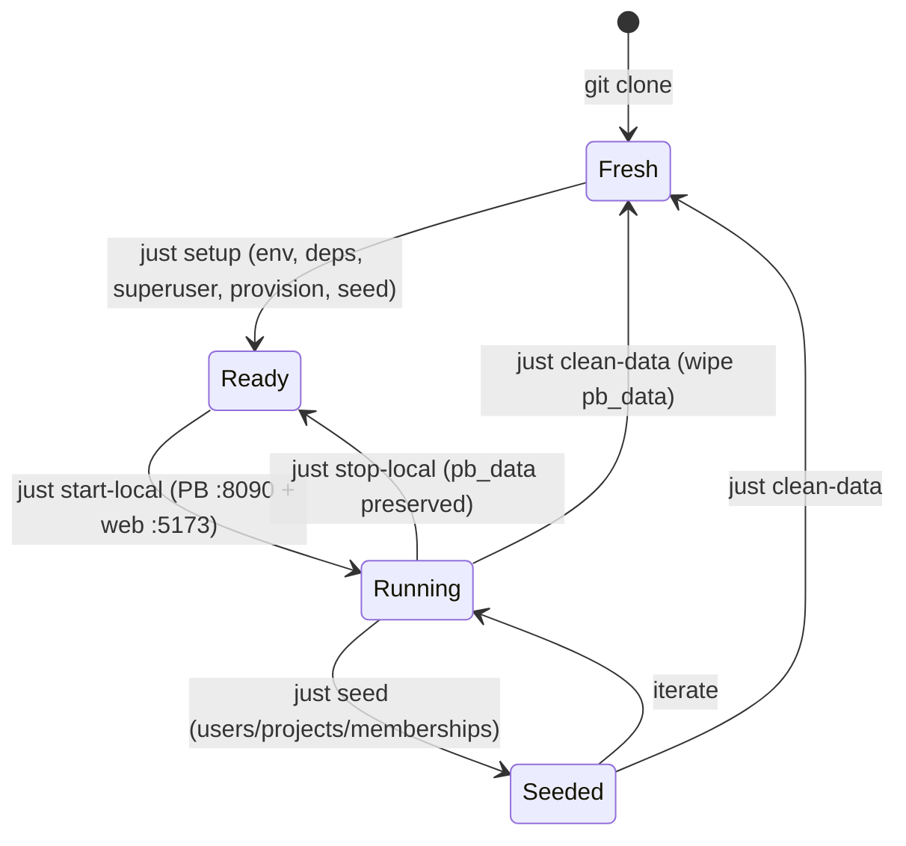

[🏠 Cetana Labs](../../README.md) / [📚 Docs](../README.md) / Guides / **Developer Guide**

# Cetana Labs — Developer Guide (Local Setup & Environment)

> **Scope:** local/cloud **setup, commands, database & auth** — how to *develop* on this repo. For the delivery process (Spec → gate) see [`aidlc-guide.md`](aidlc-guide.md); for promoting to staging see [`release-guide.md`](release-guide.md); for how **leads write `STATUS.md`** see [`project-owner-guide.md`](project-owner-guide.md).
>
> 📋 Decision of record: [`RFC-LAB-000-007`](../rfc/RFC-LAB-000-007-work-environment.md).
> Adapted from the Nexus Pulse (`LAB-003`) Developer Guide, translated to this stack
> (PocketBase + SQLite + SvelteKit, not Postgres/Supabase).
>
> *(Renamed from `work-environment.md`; process + deploy content split out into the AIDLC + Release guides.)*

This is the authoritative guide for **setting up and running Cetana Labs locally**. Who executes a build (KiroCrew Operator · Antigravity primary · Kiro IDE escalation · Kiro Web fallback) is the **AIDLC Guide's** executor model — see [`aidlc-guide.md`](aidlc-guide.md) §3.

---

## ⚡ Command Cheat-Sheet

Cetana Labs standardizes on **`just`** (`justfile`) as the task runner, sharing a common cross-repo core with Nexus Pulse (Director decision: one shared command vocabulary across Agni repos). Run `just` or `just --list` any time for the full cheat-sheet.

A thin **`Makefile` forwarding shim** is maintained for one sprint to preserve backward compatibility (`make <target>` forwards to `just <target>`).

Every command exists as both a Kiro `/command` and a `just` recipe (identical behavior).

| Category | Just recipe | Make (shim) | Slash command | What it does |
|---|---|---|---|---|
| **Help** | `just` / `just help` | `make help` | — | Show recipe cheat-sheet (`just --list`) |
| **Readiness** | `just env-doctor` | `make env-doctor` | `/env-doctor` | Surface-aware check: is *this* environment ready? (diagnostic only) |
| **Validate** | `just validate-local` | `make validate-local` | `/validate-local` | Full local pre-flight: Python validators + SvelteKit type-check/build |
| | `just validate-staging` | `make validate-staging` | `/validate-staging` | Probe staging health (Railway/Vercel) |
| **Local stack** | `just start-local` | `make start-local` | `/start-local` | Start PocketBase (:8090) + SvelteKit dev (:5173) |
| | `just stop-local` | `make stop-local` | `/stop-local` | Stop dev servers (preserves data) |
| | `just status-local` | `make status-local` | `/status-local` | Are the servers up? |
| **Setup** | `just setup` | `make setup` | — | One-time bootstrap: env, deps, superuser, provision, seed |
| **Data** | `just provision` | `make provision` | — | Create collections via API (version-robust) |
| | `just seed` | `make seed` | — | Provision + seed PocketBase from `data/` |
| | `just export-live-data` | `make export-live-data` | — | Export live PocketBase records to `data/*.json` (reconciliation, BK-014) |
| | `just clean-data` | `make clean-data` | — | Reset local DB to a clean slate |
| **Containers** | `just pb-image` | `make pb-image` | — | Build PocketBase image (Podman-first) for staging parity |
| **Sprint** | — | — | `/sprint-start`, `/sprint-done` | Open / close a sprint |
| **Audit** | — | — | `/audit-doc`, `/audit-project` | Doc review / project health sweep |

> Run `just` (or `just --list`, or `make help`) any time for this list.
> **Deploy recipes** (`deploy-staging`, `deploy-adhoc`, `verify-bundle`, `verify-live-frontend`) are documented in the **[Release Guide](release-guide.md)** — the normal staging deploy is automatic on merge (§1 there).

---

## 1. Local-dev surfaces (where setup work happens)

For **this guide's purpose — setup and local development** — two surfaces matter (`RFC-LAB-000-007` §2.1). This is narrower than the full executor model (Operator / Antigravity / Kiro IDE / Kiro Web), which is in [`aidlc-guide.md`](aidlc-guide.md) §3:

| Surface | For local setup | Do this here |
|---|---|---|
| **Kiro Web** | **Stateless** governance/docs | RFCs, trackers/backlog/changelog/journal, `data/` edits, Python `scripts/`, status broadcasts — no persistent servers |
| **Kiro IDE** (local) | **Stateful** servers/data | `/start-local`, PocketBase DB, SvelteKit UI dev, secrets/OAuth |

Not a hard wall — Web can edit anything, it just can't run persistent servers.

### Cloud workflow (Kiro Web) — the stateless loop

For governance/docs/scripts work, the entire loop runs in the browser with **zero local footprint** (`RFC-LAB-000-001`). `LAB-000` is a documentation + zero-dependency-Python control plane whose automation already runs in GitHub Actions:


**The live app:** the portfolio is the deployed **Sleek UI** (SvelteKit → Vercel, reading PocketBase → Railway) — see the [Release Guide](release-guide.md). *(The old build-time GitHub-Pages dashboard, `docs/index.html` + `generate_dashboard.py`, was retired at M5, `RFC-LAB-000-011`.)*

**Environment classification (for new initiatives):** classify each project's `Dev Environment` using the heuristic in [`RFC-LAB-000-001` §4](../rfc/RFC-LAB-000-001-cloud-dev-migration.md) and record it in `STATUS.md` + the registry:
- **☁️ Cloud (default)** — docs, research, static generators, CI-executed automation. `LAB-000` runs primary on **Kiro Web**; it shifts to **Codespaces** if/when it grows persistent services (db + server) — declared in `.devcontainer/`, staying fully cloud-based (the web-app + RBAC evolution, `BK-007`/`BK-008`).
- **💻 Local** — needs persistent local services, hardware (GPU/CV/edge), data-residency, or a heavyweight native toolchain.

---

## 2. Prerequisites (Kiro IDE / local)

Toolchain is **Homebrew-native** on the reference MBP work machine (nvm/pyenv shell
hooks are intentionally disabled for fast terminal startup — do **not** rely on `nvm`).

- **Python 3.11+** (governance scripts are zero-dependency; no venv needed). `uv` is the standard if deps are ever added.
- **Node** & **pnpm 10.27** via Homebrew (`/opt/homebrew/bin/node`, `/opt/homebrew/bin/pnpm`). `package.json` pins `packageManager: pnpm@10.27.0`; Corepack keeps it consistent. No per-project Node switching.
- **PocketBase >= 0.23** — system binary via Homebrew (`pb` / `pocketbase`, on PATH at `/opt/homebrew/bin`), or fetched by `.devcontainer/setup-pocketbase.sh` in cloud/CI.
- **Podman** (preferred; `pod-start`/`pod-stop` manage the VM) or Docker context — only for containerized workflows; local dev runs the `pb` binary directly.

Kiro Web needs none of the server tooling — it's for stateless work.

> ### Local Dev — DX quick reference (recurring gotchas, all handled)
> These bit us during v0.14.0 local testing; the fixes are in the repo now, but know them:
> 1. **PocketBase is a PATH binary, not `./pocketbase`.** Install is Homebrew (`brew install pocketbase` → `/opt/homebrew/bin/pocketbase`). The repo has **no committed `pocketbase` file** (gitignored). Never run `./pocketbase` or `cd app/pocketbase && ./pocketbase` — use `just start-local` / `just setup` (they resolve the PATH binary) or `pocketbase serve --dir app/pocketbase/pb_data`.
> 2. **`just seed` needs `.env` — now auto-loaded.** `set dotenv-load := true` in the `justfile` sources the root `.env` (`PB_ADMIN_EMAIL`/`PB_ADMIN_PASSWORD`) into every recipe. If you call PocketBase/Python directly outside a recipe: `set -a && source .env && set +a` first.
> 3. **Always pin `--dir app/pocketbase/pb_data`** on any raw `pocketbase serve` / `superuser` from the repo root — otherwise PocketBase writes a **stray `pb_data/` at the root** (the recurring `git status` noise). The `just` recipes and `scripts/setup-local.sh` do this for you.
> 4. **OAuth: browse at `http://localhost:5173`** (not `127.0.0.1`) to match the registered GitHub callback `http://localhost:5173/oauth/callback` — a host mismatch passes the authorize step but 400s the token exchange (§5.1).
>
> **Fastest clean start:** `just setup` (end-to-end: superuser + schema + seed, PATH binary, canonical dir), then `just start-local`.

---

## 3. Initial Setup (first time, local)

**One command** (recommended) — idempotent bootstrap with sensible local defaults:

```bash
just setup            # env + web deps + PocketBase superuser + schema hint + seed (or: make setup)
# equivalently: bash scripts/setup-local.sh
```
Defaults: superuser `admin@cetana.local` / `CetanaLocal2026!` (override via `PB_ADMIN_EMAIL` / `PB_ADMIN_PASSWORD` env or `.env`). The script prints the Admin UI import step for `pb_schema.json`, then offers to seed from `data/`. Re-runnable any time.

<details><summary>Manual steps (if you prefer)</summary>

```bash
cp .env.example .env                                   # set PB_ADMIN_*
cd app/web && pnpm install --frozen-lockfile && cd ../..
pb superuser upsert admin@cetana.local 'CetanaLocal2026!'   # >= 8 chars
pb --version                                            # confirm >= 0.23
just env-doctor
```
</details>

---

## 4. Starting the Local Stack

The `just` recipes (or `make` shim) move the local stack between states:



Two modes, mirroring Nexus Pulse's State A / State B:

### State A — Clean slate (recommended default)
```bash
just start-local
```
Starts PocketBase (`:8090`, admin `/_/`) and SvelteKit dev (`:5173`) with an empty DB — good for onboarding/intake flows.

### State B — Seeded from `data/`
```bash
just start-local            # in one terminal (PB + web)
# then, with PB_ADMIN_* set in .env:
just seed                   # provisions collections (API) + seeds users/projects/memberships
```
`just seed` runs `pb_provision.py` (creates collections via the API — version-robust, no manual schema import) then `pb_import.py` (seeds the 3 users, 6 projects, memberships from the relational masters, `RFC-LAB-000-002`). `just setup` does this end-to-end on first run.

### Stop
```bash
just stop-local             # frees :5173 and :8090; pb_data preserved
```

---

## 5. Database & Auth (local)

| Parameter | Value |
|---|---|
| PocketBase URL | `http://127.0.0.1:8090` |
| Admin UI | `http://127.0.0.1:8090/_/` |
| Data file | `app/pocketbase/pb_data/` (SQLite, gitignored) |
| Superuser | from `.env` (`PB_ADMIN_EMAIL` / `PB_ADMIN_PASSWORD`) |

> ⚠️ **The `pb_data` location gotcha (learned the hard way — `RFC-LAB-000-008` M3–M4).**
> PocketBase resolves `pb_data` **relative to its current working directory**. The
> **one canonical location is `app/pocketbase/pb_data`** — always start the backend so it
> lands there, i.e. **`just start-local` / `just pb-serve`** (they `cd app/pocketbase`
> first), or `pocketbase serve --dir app/pocketbase/pb_data` from the repo root. If you
> `pocketbase serve` from some *other* directory (e.g. `/opt/homebrew/bin`), it silently
> creates a **separate, empty `pb_data` there** — your seed, OAuth config, and schema all
> go to the wrong place, and `just start-local` then serves an empty backend. All backend
> state (superuser, collections, seed, **OAuth provider config**) lives inside whichever
> `pb_data` is active, so a mismatch looks like "everything vanished."
>
> **Symptoms:** anon reads return `404 "Missing collection context"`; superuser auth
> `400`; the dashboard is empty though you "just seeded it."
> **Recovery (rebuild the canonical instance):**
> ```bash
> just stop-local                                  # kill any stray servers first
> pocketbase superuser upsert "$PB_ADMIN_EMAIL" "$PB_ADMIN_PASSWORD" --dir app/pocketbase/pb_data   # PATH binary; --dir avoids the CWD trap
> just start-local                                 # serves app/pocketbase/pb_data
> just seed                                        # provision + seed the canonical dir
> ```
> Then re-add the GitHub OAuth provider once (§5.1) — the OAuth **client secret is not
> committed and does not migrate between data dirs**, so a fresh `pb_data` needs it re-entered.
> **Rule of thumb:** never `pocketbase serve` from a raw shell in an arbitrary directory;
> use the `just` recipes so the data dir is always canonical.

**Test personas & RBAC (forward — Phase 3, `RFC-LAB-000-006`):** once GitHub OAuth + roles land, personas map to the `memberships` roles (`owner`/`lead`/`contributor`/`reviewer`/`stakeholder`). Provisioning steps will be added here when auth is built.

### 5.1 GitHub OAuth setup (PocketBase v0.40+)

> **Version note (verified on v0.40.4):** OAuth2 providers are configured **per auth collection**, *not* in a global "Settings → Auth providers" menu (that path was removed after PocketBase ≤0.22). This tripped us once — documented here so it doesn't again. Applies to local dev **and** the deployed backend (`RFC-LAB-000-011`).

**1. Create a GitHub OAuth app** — GitHub → Settings → Developer settings → **OAuth Apps** → New OAuth App:
- **Homepage URL:** `http://localhost:5173` (local) / your Vercel URL (deployed).
- **Authorization callback URL:** `http://localhost:5173/oauth/callback` (local) / your Vercel URL + `/oauth/callback` (deployed). This is the **frontend** callback the BK-018 redirect flow returns to (`${window.location.origin}/oauth/callback` — `app/web/src/lib/auth.svelte.ts`), **NOT** PocketBase's `/api/oauth2-redirect` (that direct-provider endpoint was dropped in BK-018 because PB's `/api/realtime` channel breaks behind Railway's proxy — `RFC-LAB-000-011` §4.5).
  - ⚠️ **Host-consistency footgun:** GitHub treats `localhost` and `127.0.0.1` as **different hosts**, and it requires the token-exchange `redirect_uri` to match the authorize step exactly. Browse the app and register the callback on the **same** host (use `http://localhost:5173` for both). A `localhost`↔`127.0.0.1` mismatch passes the authorize step but fails the token exchange with **`400 Failed to fetch OAuth2 token`**.
- Copy the **Client ID** and generate a **Client Secret**.

**2. Enable it in PocketBase** — admin UI (`http://127.0.0.1:8090/_/`):
- **Collections → `users` → edit (gear) → Options tab → OAuth2 → Enable → `+ Add provider` → GitHub** → paste Client ID + Secret → Save.
- (This is where the earlier "Settings → Auth providers" instruction now lives.)

**3. Secrets discipline (`RFC-LAB-000-011` §4.3):** the client id/secret live in the **PocketBase admin**, never in the repo. The frontend needs only `VITE_PB_URL`. For the deployed backend, secrets go in the VM env / GCP Secret Manager; update the callback URL to the production PocketBase domain.

**4. Superuser escape hatch:** the PB superuser (admin UI) login is independent of OAuth — if OAuth is misconfigured, you are not locked out.

**5. Ownership linking — how owner-writes resolve (M3–M4, learned in verification).** PocketBase creates a **separate auth record per GitHub OAuth identity**; it does *not* reuse a pre-seeded `users` row, and `mappedFields` can't populate a custom field. So an OAuth login's record starts with an **empty `github_handle`**, and its record `id` differs from the seeded owner the `projects.owner` relation points to. Two pieces make owner-writes work:
- **`pb_hooks/oauth_github_handle.pb.js`** — an `onRecordAuthWithOAuth2Request` hook copies the GitHub login into `github_handle` on sign-in (idempotent; only when empty). *(Hooks load from `app/pocketbase/pb_hooks/` at startup — another reason to start PB from `app/pocketbase/`; they're committed, unlike `pb_data`.)*
- **`projects.updateRule` matches on handle, not id:** `@request.auth.id != "" && @request.auth.github_handle != "" && owner.github_handle = @request.auth.github_handle`. This is environment-robust (record ids change per seed; handles don't) and matches how the UI already resolves ownership.
- **Existing OAuth records** created *before* the hook won't have a handle — either sign out/in again (the hook backfills) or set `github_handle` once in the admin. A brand-new local `pb_data` needs neither (the hook runs on first sign-in).

### 5.2 App-Level Settings Pattern (`RFC-LAB-000-013` / `BK-012`)

App settings are runtime-configurable values read by the SPA (starting with `app_name` and `app_description`), serving as the foundation for `BK-013` branding and white-labeling:

1. **Collection (`settings`):** Key/value store with fields `key` (text, unique, required), `value` (text), `type` (select: `string`|`number`|`boolean`|`url`), and `group` (text, optional). Declared in `scripts/generate_pb_schema.py`, seeded via `data/settings.json` + `data/settings.schema.json`.
2. **Typed Accessor Façade (`app/web/src/lib/settings.ts`):** Eagerly loads settings once and exposes typed getters with hardcoded defaults:
   - `settings.appName(): string` (default: `'Cetana Labs Control Hub'`)
   - `settings.appDescription(): string` (default: `'Protocol Engine'`)
   - Absent or empty keys return the hardcoded default (resilience: no crash, no blanking).
   - Values are cast per `type`; callers never touch raw database rows.
3. **How to add a new setting:**
   - Add a seed entry in `data/settings.json`: `{"key": "my_setting", "value": "val", "type": "string", "group": "general"}`.
   - Add a default and typed getter in `app/web/src/lib/settings.svelte.ts`:
     ```ts
     mySetting(): string { return this.get('my_setting', DEFAULT_VALUE); }
     ```
   - Consume anywhere via `settings.mySetting()`.
4. **RBAC Posture:**
   - `listRule` / `viewRule`: **public** (`""`) so branding renders pre-auth on public dashboards.
   - `createRule` / `updateRule` / `deleteRule`: **superuser-only** (`null`). Non-superuser writes are denied. General admin write paths require the admin role (`BK-014`).
5. **Logo Settings (`BK-013`):** `logo_icon_url`, `logo_small_url`, and `logo_medium_url` are seeded with empty string defaults (`type: "url"`, `group: "branding"`). When empty, the app renders text branding only. Settings must strictly contain non-sensitive configuration — **never store secrets in settings**.

### 5.3 White-Labeling a Deploy (`BK-013` / `RFC-LAB-000-011`)

A per-client or white-labeled deployment can customize the app name, description, and logo set **without a code change**:

1. **Branding Settings Available:**
   - `app_name`: String (default: `'Cetana Labs Control Hub'`). Rendered in page titles, header branding, and dashboard masthead.
   - `app_description`: String (default: `'Protocol Engine'`). Rendered in masthead subtitle and metadata.
   - `logo_small_url`: URL reference to an asset (e.g., `/brand/logo.svg` or hosted CDN). Displayed in header navigation and dashboard masthead.
   - `logo_icon_url`: URL reference to a square icon asset. Used as fallback icon in headers or compact footers.
   - `logo_medium_url`: URL reference to a medium-sized logo asset.

2. **Two Deployment Paths:**
   - **Live PocketBase Path (`VITE_PB_SOURCE=auto` or `pocketbase`):**
     Update the records in the `settings` collection directly via PocketBase Admin UI (`/_/`) or seed them via `scripts/pb_import.py --apply`. The SPA fetches settings at runtime on load.
   - **Static Snapshot Path (`VITE_PB_SOURCE=snapshot`):**
     Edit `data/settings.json`, run `node app/web/scripts/copy-data.js` (or `pnpm build`), and deploy the static build. No database connection required.

3. **Data Change, Not a Code Change:**
   Branding is purely data-driven. The accessor (`SettingsAccessor`) reads settings with built-in fallbacks. When logo URLs are unset or empty, the UI displays text branding only with zero broken images and zero layout shift.

### 5.4 In-App CRUD & Data Reconciliation (`BK-014` / `D-CRUD-1`)

Cetana Labs operates on a dual source-of-truth model:
- **Live Writes**: Admin-tier CRUD operations (`/admin/projects`, `/admin/developers`, `/admin/settings`) write directly to the live PocketBase database (`RULE_ADMIN` gated).
- **Committed Masters**: `data/portfolio.json` and `data/users.json` are the committed git source-of-truth for the README master registry and static offline snapshot fallbacks.

#### The Reconciliation Workflow
When projects or developers are created, updated, or removed in-app, the live database legitimately diverges from the committed files. The admin UI displays an **honesty divergence banner** indicating that the database differs from committed masters.

To synchronize live changes back to the repository and update the README registry:

1. **Perform in-app edits** via `/admin/projects` or `/admin/developers`.
2. **Export live records to data masters**:
   ```bash
   just export-live-data    # (or: python3 scripts/export_pb_to_data.py --apply)
   ```
   This script reads live `projects` and `users` from PocketBase, maps internal IDs to canonical natural keys (`seed_id`, `lab_id`), and writes formatted `data/portfolio.json` and `data/users.json`.
3. **Verify and regenerate the registry**:
   ```bash
   just validate-local      # runs validators + generates updated README registry
   ```
4. **Commit via a Pull Request**:
   Commit the updated `data/*.json` and regenerated `README.md` on a branch and submit a PR for human review.

> **Governance Principle (`D-CRUD-1`):** In-app edits never automatically commit to git behind the scenes. Reconciliation is a deliberate, auditable step that preserves human review and gate integrity over the control plane's public registry.

---

## 6. Full Clean Reset

```bash
# Fast: wipe local DB data, keep schema/binary
just clean-data && just seed   # (or: make clean-data && make seed)

# Deep (container path): rebuild the PocketBase image
podman build -t cetana-pocketbase -f app/pocketbase/Containerfile app/pocketbase   # or: docker build ...
```

---

## 7. Config Sync — Personal vs Project (one-way)

- **Project config** (`.kiro/skills/`, `.kiro/steering/`) is **committed** → travels with the repo to both surfaces automatically. No action needed.
- **Personal config** (`~/.kiro/skills/` — `/sign-in`, `/sign-off`, `/session-save`, `/session-resume`) is **local**. Kiro Web can't read it directly.
  - **Local `~/.kiro/` is the source of truth.** After editing, push via **Kiro Web → Settings → Sync** (one-way local→cloud). Web edits do NOT flow back.
  - A temporary `my-kiro` symlink to `~/.kiro` (for viewing in the IDE) is gitignored — never commit it.

---

## 8. Development process, delivery & release — see the dedicated guides

The developer guide stops at *setup and local development*. The process and deployment content that used to live here has moved to focused guides so each reads cleanly:

| You want to… | Go to |
| :--- | :--- |
| Understand the delivery method (Spec → `/spec-run` → verify → gate), work-class routing, who executes | [`aidlc-guide.md`](aidlc-guide.md) — **AIDLC Guide** |
| Run a unit of work operationally (the five phases, commands, state machine) | [`sprint-lifecycle.md`](sprint-lifecycle.md) — **Sprint Lifecycle** |
| Promote a merge to staging / operate a deploy (Vercel + Railway, CLI ops, verify-bundle) | [`release-guide.md`](release-guide.md) — **Release Guide** |
| Run a POC at speed with light ceremony | [`mini-aidlc-guide.md`](mini-aidlc-guide.md) — **Mini-AIDLC Guide** |

**The three invariants you carry everywhere** (branching — [`RFC-LAB-000-004`](../rfc/RFC-LAB-000-004-branching-model.md)):
- **App code / `data/` / migrations** → feature branch → PR → green CI → squash-merge to `main`. **Governance / docs** → may fast-path to `main`.
- Always run `just validate-local` before a PR or `/sprint-done`. Never force-push `main`; roll back via revert PR.
- **The agent never pushes `main` and never merges — that gate is always the human's.** After an Operator governance/docs fast-path commit you will routinely see local `main` "1 ahead of origin"; that is the *designed* handoff — **you push it** (GitHub Desktop or `git push origin main`). If a push/merge fails with `remote: Internal Server Error` + a Request ID while reads work, that is a transient GitHub write-path outage — wait and retry (do not re-author or re-branch).
---

> 🧭 **Navigation:** [⬆️ Top](#) · [🏠 Repo](../../README.md) · [📚 Docs Hub](../README.md)
