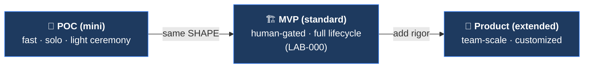

[🏠 Cetana Labs](../../README.md) / [📚 Docs](../README.md) / Guides / **Mini-AIDLC Guide**

# Cetana Labs — Mini-AIDLC Guide (POC-Speed Delivery)

> **Scope:** when and how to run AIDLC at **POC speed** — the same *shape* as the full method, far less ceremony. This guide is the *entry point + decision*; the **authoritative, copyable kickstarter** (bootstrap prompt, artifact stubs, graduation runbook) lives in [`templates/aidlc-mini/`](../../templates/aidlc-mini/KICKSTART.md) and is **not duplicated here** by design.
>
> 🤝 Full method: [`aidlc-guide.md`](aidlc-guide.md). This is its lightweight sibling for the pre-MVP stage.

---

## 1. When to use Mini-AIDLC

Process formality should scale with product maturity — not be full-blown on day one, and not a throwaway you rewrite later.

- **Use Mini-AIDLC for:** a fresh POC / spike where you want AIDLC's *discipline* (phase shape + human gate + decision capture) without the full ceremony (RFCs, Specs, validators, state machine).
- **Graduate to full AIDLC** ([`aidlc-guide.md`](aidlc-guide.md)) when the POC is approved for real development — via `/graduate`, which *adds rigor to the same artifacts* rather than rewriting them.

## 2. The non-negotiables (kept even at POC speed)

These three are cheap and are what make it *AIDLC* and not just fast coding — **never drop them:**

1. **The phase shape** — `brainstorm → implement → verify → done`. Collapse/accelerate it, but keep the four beats.
2. **The human gate** — a human explicitly says "yes, good" before anything counts as *done*. Nothing is done on the agent's say-so alone.
3. **The Decision Journal** — capture *why* for real decisions (stack choice, approach, pivots). At POC these are the formative bets.

## 3. What's relaxed vs deferred

| Concern | Mini (POC) | Grows into (MVP) |
| :--- | :--- | :--- |
| Contract | one `POC-SPEC.md` or an inline ask | full 3-file Kiro Spec |
| Verification | eyeball checklist, noted in the log | full human-verification loop + log |
| Git flow | commit freely; PR at milestones | branch-per-feature, PR-per-Spec, merge-first |
| Tracking + changelog + journal | collapsed into one `POC-LOG.md` | `SPRINT_TRACKER` + `CHANGELOG` + `DECISION-JOURNAL` |

**Deferred to standard** (skip at POC; `/graduate` adds them): RFCs, merge-first rule, state machine + guards, validators/lockstep, the full command suite (`/spec-run`, `/plan-*`, `/review-pr`), the two-surface split.

## 4. How to start a POC

The complete bootstrap prompt, the `POC-LOG.md` / `POC-SPEC.md` stubs, and the `/graduate` migration runbook are in the kickstarter — **copy that folder into a fresh POC repo and follow it:**

➡️ **[`templates/aidlc-mini/KICKSTART.md`](../../templates/aidlc-mini/KICKSTART.md)** — the authoritative source (bootstrap prompt + model).

Companion files in that folder:
- [`POC-LOG.md`](../../templates/aidlc-mini/POC-LOG.md) — the single collapsed artifact stub (sectioned along graduation seams).
- [`POC-SPEC.md`](../../templates/aidlc-mini/POC-SPEC.md) — the lightweight, forward-compatible contract stub.
- [`MIGRATION.md`](../../templates/aidlc-mini/MIGRATION.md) — the graduation runbook (POC → standard).

---

> 🔙 Back to the [Docs Hub](../README.md) · Related: [AIDLC Guide (full method)](aidlc-guide.md) · [Mini-AIDLC Kickstarter](../../templates/aidlc-mini/KICKSTART.md)
