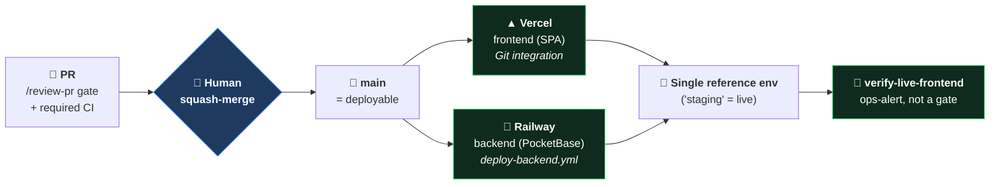

[🏠 Cetana Labs](../../README.md) / [📚 Docs](../README.md) / Guides / **Release Guide**

# Cetana Labs — Release Guide (Promote to Staging & Operate)

> **Scope:** how a merged change *becomes live* — the deploy model, the staging promotion, the CLI ops loop, and the post-deploy verification. For local setup see [`developer-guide.md`](developer-guide.md); for the delivery process (Spec → PR → gate) see [`aidlc-guide.md`](aidlc-guide.md).
>
> 📋 Decisions of record: [`RFC-LAB-000-011`](../rfc/RFC-LAB-000-011-deployment.md) (architecture — Vercel + Railway) · [`RFC-LAB-000-012`](../rfc/RFC-LAB-000-012-deploy-operations.md) (CLI-first ops). Decision Journal **Entry 014** (the single-reference-environment model).

---

## TL;DR — how a change goes live



**The gate is the merge.** A squash-merge to `main` auto-deploys **both tiers** (Vercel frontend + Railway backend) to the one reference environment. There is no separate "release" button — merging *is* the promotion. A deploy hiccup is an **ops alert** (a red workflow + logs), never a lifecycle failure, and never reverts the merge.

---

## 1. The deployment model — `main` = the single reference environment

(Decision Journal **Entry 014**; `RFC-LAB-000-012` §4.)

The lifecycle ends at **`done` = merged to `main` = live** on the project's **single reference environment** ("staging"). There is exactly one automated environment, and **a merge to `main` deploys both tiers to it**:

```
  PR ──/review-pr (gate: review + required CI)──▶ merge to main ─┬─▶ Vercel  (frontend)  — existing Git integration
                                                                 └─▶ GitHub Actions → Railway (backend)
                                                                      — deploy-backend.yml, path-filtered app/pocketbase/**
                                                                 = the SINGLE REFERENCE ENVIRONMENT ("staging")
```

- **The gate is the merge.** The PR review + required CI checks (`ci-validate.yml`) are the deploy gate. Everything on `main` is deployable, so auto-deploy is safe.
- **`done` = the merge (pragmatic, D50).** Deploys are *consequences* that make `done` observable. A deploy hiccup is an **ops alert** (a red `deploy-backend.yml` run + logs), **not** a lifecycle failure — it never reverts the merged commit. There is no auto-rollback.
- **Two symmetric tiers.** Frontend (Vercel, already wired) + backend (Railway, via `deploy-backend.yml`). `deploy-backend.yml` is deliberately **not** a required check — a deploy failure must not block future merges.
- **Two deliberately-separated paths:**
  1. **Auto-staging (the pipeline)** — push to `main` deploys both tiers to the single reference env. No manual target for the normal path; the merge is it. (`just deploy-staging` is only a manual *override* re-deploy of that same env.)
  2. **On-demand `/deploy-adhoc` (a dev tool)** — `just deploy-adhoc ENV=<file>` deploys to an *arbitrary* instance (throwaway/other) for testing. **Not** a lifecycle stage, **not** "release."
- **Explicit scope boundary (Entry 014, D51/D52).** No staging→prod promotion pipeline, no dedicated prod tier, no blue-green/canary — that is out-of-scope ops (`BK-019`). One automated environment only. Branch-protection config itself is a one-time [HUMAN] GitHub setting (the gate), assumed here, not scripted.

---

## 2. Architecture (what/where) — `RFC-LAB-000-011`

> Decision of record: [`RFC-LAB-000-011`](../rfc/RFC-LAB-000-011-deployment.md) (amended, Entry 010 — **Vercel frontend + Railway backend**, superseding the earlier GCP-VM plan). Delivered by MVP **M5** (`TSK-054`, `BK-011`).

**Architecture:** SvelteKit static SPA → **Vercel**; PocketBase (container + SQLite on a persistent volume, managed HTTPS) → **Railway**. The SPA reads `VITE_PB_URL` (the Railway URL); OAuth + secrets live on Railway; **no secret is committed**.

**Sequencing (RFC-011 §5):** backend (Railway) **first** → frontend (Vercel) → verify live → **then** retire any stopgap. Never remove a working dashboard before the deployed app is verified.

### 2.1 First-time environment stand-up (Railway backend, do first)
1. **Create the service** from the repo's `app/pocketbase/Containerfile` (Railway → New → Deploy from repo / Dockerfile).
2. **Attach a persistent volume mounted at the container's `pb_data/`** — *this is the crux; without it a redeploy wipes the database.*
3. Set Railway **service env**: `PB_ADMIN_EMAIL`, `PB_ADMIN_PASSWORD` (superuser — admin escape hatch). OAuth secrets come in §2.3.
4. Deploy; note the **managed HTTPS URL** (`https://<app>.up.railway.app`). The `pb_hooks/oauth_github_handle.pb.js` hook ships in the image.

### 2.2 Seed collections against Railway (first time)
Point the local scripts at the Railway URL (env passed on the command line — nothing committed):
```bash
PB_URL=https://<app>.up.railway.app \
PB_ADMIN_EMAIL=... PB_ADMIN_PASSWORD=... \
python3 scripts/pb_provision.py --apply     # collections + rules (incl. owner updateRule)
PB_URL=https://<app>.up.railway.app \
PB_ADMIN_EMAIL=... PB_ADMIN_PASSWORD=... \
python3 scripts/pb_import.py --apply         # 6 projects / 3 users / memberships
```
Confirm: `curl https://<app>.up.railway.app/api/collections/projects/records` returns the projects.

### 2.3 Production GitHub OAuth
1. In the GitHub OAuth app (or a dedicated prod app), set **Authorization callback URL** → `https://<your-vercel-app>/oauth/callback` (the deployed **frontend** origin + `/oauth/callback`, matching the BK-018 redirect flow — NOT the PocketBase `/api/oauth2-redirect` endpoint).
2. On the **Railway** PocketBase admin (`https://<app>.up.railway.app/_/`), enable OAuth2 on the `users` collection and add GitHub (client id + secret) — same per-collection path as the developer guide §5.1. Secrets stay in Railway/PB, never in the repo.

### 2.4 Frontend — SvelteKit on Vercel
1. Connect the repo; set the Vercel project **root to `app/web`** (SvelteKit `adapter-static`).
2. Set the Vercel env var **`VITE_PB_URL = https://<app>.up.railway.app`** (the Railway URL).
3. Deploy; note the **`https://<app>.vercel.app`** URL. Vercel gives production + per-PR previews.

### 2.5 Verify live
Verify on the live URLs: backend seeded, frontend reads Railway, prod sign-in, owner-write persists, **non-owner denied** (RBAC), **data survives a redeploy** (the volume).

### 2.6 Backups (starter)
Use Railway **volume snapshots** to start; a scheduled `pb_data` export to object storage is the hardening follow-up (RFC-011 OQ).

---

## 3. CLI-first ops loop (ad-hoc / on-demand) — `RFC-LAB-000-012`

> The *normal* staging deploy needs none of this — it is the merge (§1). This loop is the **on-demand / ad-hoc** path (`/deploy-adhoc`, one-time linking, artifact verification), and the manual staging-override re-deploy.

The **UIs are for one-time linking + inspection only**; the iteration loop is the CLI (reproducible, greppable, scriptable — `RFC-LAB-000-012` §3):

```bash
cp .env.staging.example .env.staging   # fill in PB_URL / VITE_PB_URL (gitignored)
railway login && vercel login          # one-time per machine
just deploy-staging                    # == scripts/deploy.sh all (manual override re-deploy)
#   → deploy-backend  : railway up (from app/pocketbase, railway.json pins the builder)
#   → deploy-frontend : build with VITE_PB_URL → verify-bundle → vercel deploy
#   → prints the one-time [HUMAN] checklist
```
Deploy one tier at a time with `scripts/deploy.sh deploy-backend` / `deploy-frontend`. Config lives in repo-committed files (`vercel.json`, `railway.json`); the dashboard drives **nothing** in the loop — inspect deploys/logs there, don't iterate from it.

### 3.1 The scaffold
| Piece | Path | Purpose |
| :--- | :--- | :--- |
| Backend build pin | `app/pocketbase/railway.json` | Pins Railway to the `Containerfile` (`builder: DOCKERFILE`) so it never auto-detects the build. |
| Deploy wrapper | `scripts/deploy.sh` + `just deploy-staging` | One entry point: `deploy-backend` / `deploy-frontend` / `all` / `checklist`. |
| Artifact assertion | `scripts/verify-bundle.sh` + `just verify-bundle` | Asserts the built bundle baked in the **expected** backend URL (§4). |
| Env template | `.env.staging.example` | Keys/comments only; copy to `.env.staging` (gitignored). **No secret is ever committed.** |

### 3.2 Casual → qualified environment lifecycle (`RFC-LAB-000-012` §4)
Treat a new environment **like local**: get it working casually first, harden second.

```
CASUAL (get it working)  ──verify──▶  QUALIFIED (hardened)  ──▶  (real use)
throwaway creds, iterate              rotate REAL secrets via the UI,
freely via CLI; don't                 lock down access, treat as real
sweat secrets yet                     from here on
```
- **CASUAL:** stand it up with **throwaway credentials** (shared, low-stakes), deploy freely via the CLI, iterate.
- **Qualification gate:** once the Human Verification Plan passes end-to-end → **rotate to real secrets via the UI**, lock down access, mark it qualified.
- **Guardrail:** casual ≠ careless — **no secrets in git at any stage.** `.env.staging` stays gitignored.

### 3.3 One-time [HUMAN] steps (documented, not automated)
`scripts/deploy.sh checklist` prints these:
1. **CLI login** (once per machine): `railway login`, `vercel login`.
2. **Railway persistent volume** (once per service) — the CLI **cannot** attach volumes: in the dashboard, attach a Volume mounted at **`/pb/pb_data`** (else every redeploy wipes the SQLite DB).
3. **GitHub OAuth app** (once per environment): callback at the **frontend** origin + `/oauth/callback`; client id/secret in the Railway PocketBase admin.
4. **Vercel env**: set `VITE_PB_URL` to the Railway URL (`vercel env add` or the dashboard).

### 3.4 Gated ops (`RFC-LAB-000-012` §6)
Deploy/ops/spike work follows the same branch → PR → human-gate discipline as features — nothing ad-hoc to `main`. Even throwaway spike code lands on a branch; the *finding* is what merges.

---

## 4. Verify the artifact, not the setting (`RFC-LAB-000-012` §5)

Vite inlines `VITE_*` at **build time**, so the console *setting* can say one thing while the shipped *bundle* contains another — the BK-018 false negative (a preview silently baked against the prod backend). **Rule:** before trusting any live test, assert the baked-in backend URL in the built artifact:

```bash
just web-build
just verify-bundle EXPECTED=https://<staging>.up.railway.app \
                   FORBIDDEN=https://<prod>.up.railway.app
```
`scripts/deploy.sh deploy-frontend` runs this automatically **before** the Vercel deploy and refuses to ship a bundle baked against the wrong backend.

---

## 5. The deploy signal — read Vercel's REAL status (`BK-023`, `RFC-LAB-000-012` §11)

§4 asserts the *built* artifact; this closes the complementary gap found in `BK-023`: three Vercel-build failures that all passed `/review-pr` **and** green CI, because the only Vercel-aware check the gate saw — **"Vercel Preview Comments"** — reports *comment posting*, **not** deploy health. Our CI runs `pnpm build` directly, so green CI is no proof Vercel deployed.

**Pre-merge (the gate — `/review-pr` step 2b).** The real Vercel deploy status lives on the **commit-status** API (not check-runs), as the **`Vercel`** context. Read it for the **PR head SHA**:
```bash
head=$(gh api repos/agni-eialarasu/cetana-labs/pulls/<n> --jq .head.sha)
gh api repos/agni-eialarasu/cetana-labs/commits/$head/status \
  --jq '.statuses[] | select(.context=="Vercel") | {state, target_url, updated_at}'
```
`success` on head ⇒ ✅; `failure`/`error` ⇒ ❌ HOLD; **no status for head**, or a success only on an **older SHA** (the stale-success trap — Vercel keeps serving the last good build) ⇒ ⚠️ HOLD. Failure-safe: anything but a head-bound `success` is a HOLD. **Never** treat "Vercel Preview Comments" as the deploy signal.

**Post-merge (the backstop — ops-alert).** After the Vercel Git integration deploys, assert the **live** bundle serves the expected backend:
```bash
just verify-live-frontend URL=https://<app>.vercel.app EXPECTED=https://<app>.up.railway.app
# or on CI: the verify-live-frontend.yml workflow (push to main on app/web/**, + manual run)
```
This is an **ops-alert, not a gate** — a red result is a check + logs to investigate; it never reverts the merge (`done` = the gated merge).

**[HUMAN] — make it enforce itself (durable).** The lasting fix is to make the **`Vercel` deployment status a required status check** on `main` (GitHub → Settings → Branches → branch-protection rule for `main` → *Require status checks to pass* → add the **`Vercel`** context). Then a failing Vercel build blocks merge automatically. One-time GitHub-settings action, **deferred until branch protection lands post-org-transfer** (`RFC-LAB-000-004`); until then, `/review-pr` step 2b is the enforcement.

---

> 🔙 Back to the [Docs Hub](../README.md) · Related: [Developer Guide](developer-guide.md) · [AIDLC Guide](aidlc-guide.md) · [`RFC-LAB-000-011`](../rfc/RFC-LAB-000-011-deployment.md) · [`RFC-LAB-000-012`](../rfc/RFC-LAB-000-012-deploy-operations.md)
