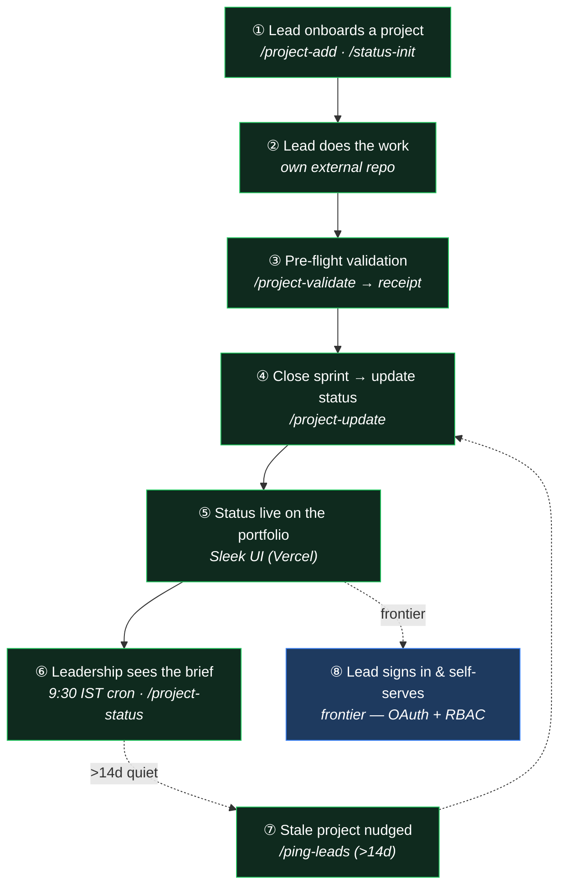

[🏠 Cetana Labs](../../README.md) / [📚 Docs](../README.md) / Reference / **Capability Map**

# Cetana Labs — Capability Map (what the app does)

> The git-tracked counterpart of the interactive **App Functionality** artifact. It records
> *what the control plane does* — capability domains and their status — distinct from *how we
> work* ([AI Collaboration Model](../governance/ai-collaboration-model.md)) and *what runs where*
> ([RFC-LAB-000-011](../rfc/RFC-LAB-000-011-deployment.md)). Living doc: update it in the same
> session a change ships, flips a status, or adds/retires a capability.

---

## Purpose

**Zero-overhead executive visibility.** Project leads report health in a 30-line `STATUS.md`;
leadership gets an auto-generated portfolio view and daily broadcast — without interrupting
engineering. Cetana Labs is a **master control plane, not a code monorepo** (mini-app source lives
in external repos).

## Status legend

| | Meaning |
| :--- | :--- |
| ✅ **shipped** | Live today (M1–M5) |
| 🔨 **in-flight** | Being built (the auth/RBAC/settings frontier) |
| 📋 **backlog** | Planned |

## Capability domains

### Registry & Portfolio — *the master catalog*
- ✅ **Master registry** — indexed catalog of initiatives (`LAB-000`…`005`); README table generated. *Driven by `/project-add`, `/project-edit`, `generate_registry.py`; data: `portfolio.json`.*
- ✅ **Portfolio UI** — owner-first cards with health badges on the Sleek UI. *Reads PocketBase (snapshot fallback); data: `portfolio` + `users`.*

### Status Engine & Validation — *the certified-truth core*
- ✅ **STATUS.md protocol** — 30-line executive status per project; never hand-written. *Driven by `/project-update`; data: `STATUS.md` + `journal.md`.*
- ✅ **5-pillar gate** — audits scraper budget, registry lockstep, git hygiene, AST boundaries, live test counts; kills metric drift. *`project_validate.py` → `validation_receipt.json`.*

### Broadcasts & Automation — *the visibility output*
- ✅ **WhatsApp briefings** — mobile executive digests. *`generate_status.py`; `/project-status`.*
- ✅ **9:30 AM IST cron** — weekday automated brief on the GitHub Actions job summary. *`project-status-cron.yml`.*
- ✅ **Lead pings** — idempotent GitHub issues for >14d-stale / onboarding-pending projects. *`ping_leads.py`.*

### Data Model — *relational source of truth*
- ✅ **users ⇄ memberships ⇄ portfolio** — M2M relational layer; the foundation RBAC activates. *JSON masters + Draft-07 schemas; PB schema generated.*

### Auth & RBAC — *the frontier*
- 🔨 **GitHub OAuth** — redirect-based `authWithOAuth2Code` (un-pins PB 0.40 via `fix-bk018-oauth-redirect`). *data: `users`.*
- 🔨 **Per-project roles** — access via explicit PocketBase API rules on the memberships join. *`RFC-LAB-000-006/-008`.*
- 🔨 **Owner-write path** — leads edit their own status in-app (superuser-write now; owner/admin = `BK-014`). *M3/M4.*

### Settings, Branding & AI — *planned*
- 🔨 **App-level settings** — key/value config + typed accessor façade. *`RFC-LAB-000-013` / `BK-012`.*
- 📋 **Branding & logo** — white-label editor + logo upload. *`BK-013`.*
- 📋 **AI assistant** — in-app AI capability. *`BK-015`.*

## User journey (one complete loop)

## The three living maps (keep in sync)

| Lens | Interactive artifact | Doc counterpart |
| :--- | :--- | :--- |
| **Process** — how we work | *Working Model* (`fd26dcf5ca990145`) | [AI Collaboration Model](../governance/ai-collaboration-model.md) |
| **Infra** — what runs where | *Runtime Infrastructure* (`cetana-labs-runtime-infrastructure`) | [RFC-LAB-000-011](../rfc/RFC-LAB-000-011-deployment.md) |
| **Function** — what it does | *App Functionality* (`cetana-labs-app-functionality`) | **this page** |

Each artifact is data-driven (one model object) with a shared sticky-dock interaction. When a change
alters any lens, update the artifact **and** its doc counterpart in the same session.
