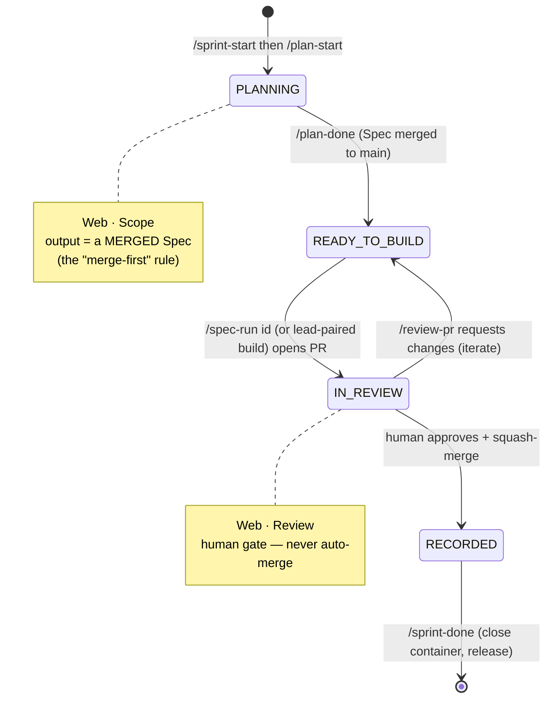
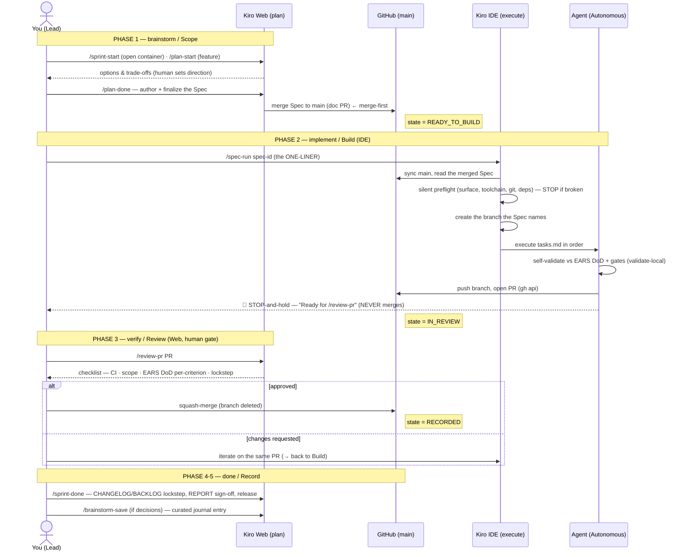

# Cetana Labs — Sprint Lifecycle & Delivery Process

> 📋 **Decision of record:** [`RFC-LAB-000-009`](rfc/RFC-LAB-000-009-sprint-lifecycle-aidlc.md) (the *why* + formal state machine).
> 🤝 **Method:** [`ai-collaboration-model.md`](ai-collaboration-model.md) (human-directed / AI-assisted / human-gated).
> 🛠️ **Surfaces & commands:** [`work-environment.md`](work-environment.md) (Kiro Web vs Kiro IDE).
> Adapted from the Nexus Pulse (`LAB-003`) Engineering Sprint Lifecycle — the *discipline*, translated to LAB-000's Kiro-native decisions (Specs not `PROMPT.md`, `gh api` not `gh pr create`, 5-pillar `make validate-local`, no Track-A/B roster).

This is the **operational guide** for how a unit of work travels from idea to merged in Cetana Labs. The RFC records the decision; this guide shows you how to *run* it, visually. It covers **both delivery paths**:

- **Lead-paired** — a human (you) + AI, working live in the IDE. Contract is light. (Progressive formality — `RFC-LAB-000-009` §5.)
- **Delegated-agent (AIDLC)** — a full Kiro Spec is authored, then executed by an agent (Autonomous mode / sub-agents) via the `/spec-run` one-liner. Contract is the Spec.

Both paths run the **same five phases** and the **same human gate**; only the *Build* phase differs (interactive vs. Spec-driven).

---

## 1. The flow at a glance

```
brainstorm  ─────────▶  implement  ─────────▶  verify  ─────────▶  done
/plan-start*            /spec-run <id>          /review-pr <PR>     /sprint-done
/plan-done              (or lead-paired build)
  (Web · Scope)          (IDE · Build)          (Web · Review)      (Record)
```

- **Order is the contract.** Every command is *phase-aware*: it checks the current state and self-corrects rather than executing blindly (§5).
- **The human gates every merge.** Nothing reaches `main` unreviewed — the AIDLC safety rail.
- **A sprint contains many plans.** `/sprint-start` opens the sprint container; within it, each feature is a `/plan-start → /plan-done` session producing one Spec.

## 2. Lifecycle state machine

The work item moves through four states. Commands are the transitions; the guards (§5) protect them.



**The merge-first rule (why the one-liner is clean):** `/plan-done` merges the Spec to `main` *during planning*. So by the time you reach the IDE, `main` already holds `.kiro/specs/<id>/`, and `/spec-run <id>` needs **only the id** — it syncs `main`, finds the Spec, and self-creates the branch. No manual checkout.

## 3. Sequence diagrams (both paths)

### 3.1 Delegated-agent path (AIDLC) — the multi-agent future

The Spec *is* the agent's brief (it has no conversational context). You supply only the spec id and, at the end, the human judgment. Everything repeatable is owned by the commands.



### 3.2 Lead-paired path — human + AI, live

Same phases and the same gate, but Build is **interactive** (no Spec-as-brief; context is supplied conversationally), and the Scope contract is **light** (a backlog row / quick ask, not a full Spec).

```mermaid
sequenceDiagram
    actor Human as You (Lead)
    participant Web as Kiro Web (plan)
    participant IDE as Kiro IDE (execute + AI pair)
    participant GH as GitHub (main)

    Note over Human,Web: PHASE 1 — brainstorm / Scope (light)
    Human->>Web: /sprint-start · /plan-start (or just raise the topic — implicit)
    Web-->>Human: quick plan / backlog row (no full Spec needed)

    Note over Human,IDE: PHASE 2 — implement / Build (interactive)
    Human->>IDE: create feat/ branch; pair on the change live
    IDE-->>Human: edits, run local stack, iterate together
    Human->>IDE: run gates (make validate-local)
    Human->>GH: push branch, open PR (gh api)
    Note right of GH: state = IN_REVIEW

    Note over Human,Web: PHASE 3 — verify / Review (still gated)
    Human->>Web: /review-pr PR  (self-review against the ask + CI)
    Human->>GH: squash-merge on approval
    Note right of GH: state = RECORDED

    Note over Human,GH: PHASE 4-5 — done / Record
    Human->>Web: /sprint-done · /brainstorm-save (if decisions)
```

> **The key difference:** in lead-paired work you *are* the executor, so `/spec-run` and a full Spec are overhead you skip — but the **verify + gate + record** phases are identical. The human gate is never optional, on either path.

## 4. Phase-by-phase walkthrough

| Phase | Command(s) | Surface | You do | The system does | Gate |
| :--- | :--- | :--- | :--- | :--- | :--- |
| **1. brainstorm** | `/sprint-start`, `/plan-start`*, `/plan-done` | Web | Set direction; decide scope; (delegated) author the Spec | Frames options; `/plan-done` **merges** the Spec to `main` | You approve the plan |
| **2. implement** | `/spec-run <id>` *(delegated)* · interactive *(lead-paired)* | IDE | Delegated: type the one-liner. Lead-paired: pair on the code | Delegated: preflight → branch → run tasks → self-validate → open PR → STOP | — (self-validated) |
| **3. verify** | `/review-pr <PR>` | Web | Review the checklist; approve or request changes | Surfaces CI, scope, **EARS DoD per-criterion**, lockstep; STOP-and-holds | **The human gate** |
| **4-5. done** | `/sprint-done`, `/brainstorm-save` | Record | Confirm close; curate decisions | Merge lockstep (CHANGELOG/BACKLOG/journal), `REPORT.md`, release tag | You curate the journal |

`*` `/plan-start` is **optional and implicit** — any free-form topic you raise is treated as a plan-start.

### Verb map

| Command | Phase | Surface | Role |
| :--- | :--- | :--- | :--- |
| `/sprint-start` | Scope (container) | Web | Opens the sprint (once); contains many plans |
| `/plan-start` *(optional, implicit)* | Scope (brainstorm) | Web | Opens a per-feature planning session |
| `/plan-done` | Scope (close) | Web | Finalizes + **merges** the Spec → `READY_TO_BUILD` |
| `/spec-run <spec-id>` | Build (implement) | IDE | One-liner Spec executor; opens PR, STOPs, **never merges** |
| `/review-pr <PR>` | Review (verify) | Web | Human gate — surfaces + STOP-and-holds |
| `/sprint-done` | Record (done) | Record | Merge lockstep + release; refuses undelivered work |

## 5. State guards — issuing a command at the wrong state

Every lifecycle command inspects the current state and responds by one of two rules — **never a silent bypass**:

- **Redundant / already-done ⇒ skip + continue.** (e.g. `/plan-start` while already planning; `/review-pr` on an already-merged PR; `/sprint-start` when a sprint is active.) The command notes it and moves on.
- **Missing prerequisite or gate ⇒ alert + HOLD.** (e.g. `/spec-run` when the Spec isn't merged to `main`; `/review-pr` with no open PR; `/sprint-done` while a sprint item's PR is still open.) The command names the exact next action and stops.

The guard is a **tripwire, not a shortcut**: a wrong-order command can skip busywork, but it can **never quietly skip a gate** — the human review, the merge-first requirement, or recording only-merged work. This is what keeps the process trustworthy while tolerant of human ordering mistakes.

## 6. Governance guarantees (why this is trustworthy, not just fast)

- **Human gate on every merge** (Phase 3) — `/review-pr` + STOP-and-hold; nothing reaches `main` unapproved.
- **CI-gated** — portfolio + 5-pillar + build checks green before merge (`RFC-LAB-000-004`).
- **Lockstep** — CHANGELOG / BACKLOG / journal / `data/` stay synchronized (validator-enforced) in Record.
- **Auditable reasoning** — `/brainstorm-save` appends curated (never auto-run) entries to the Decision Journal.
- **Linear history** — squash-merge, branch deletion, no force-push to `main`.

## 7. Worked example — MVP task M1 (the first AIDLC run)

M1 ("wire the Sleek UI to live PocketBase") is the first delegated-agent Spec (`RFC-LAB-000-008` §6). End to end:

1. **brainstorm/Scope (Web):** author `.kiro/specs/mvp-m1-live-pocketbase/` (`requirements.md` EARS DoD + `design.md` + `tasks.md` with an Execution header) → `/plan-done` **merges it to `main`**.
2. **implement/Build (IDE):** `/spec-run mvp-m1-live-pocketbase` → silent preflight → creates `feat/mvp-m1-live-pocketbase` → runs T0–T11 → verifies read-parity + fallback + gates → opens the PR → **STOPs**.
3. **verify/Review (Web):** `/review-pr <PR>` walks R1–R6; you approve or iterate.
4. **done/Record:** squash-merge → `REPORT.md` sign-off (incl. **AIDLC spike notes** — did Autonomous run `tasks.md` directly or re-plan? — `RFC-LAB-000-009` §7) → `/sprint-done`.

> **Honest status:** the lifecycle commands are *skill specifications* (procedures the IDE agent follows), and the M1 run is their first real exercise — which is also the spike for the still-undocumented Autonomous-over-existing-Spec chaining. Treat the first run as a supervised experiment and record what actually worked in the `REPORT.md`.

## 8. Related documents

- [`RFC-LAB-000-009`](rfc/RFC-LAB-000-009-sprint-lifecycle-aidlc.md) — decision of record (five phases, §3.1 state machine).
- [`ai-collaboration-model.md`](ai-collaboration-model.md) — the human-directed/AI-assisted/human-gated method.
- [`work-environment.md`](work-environment.md) — Kiro Web vs IDE surfaces + command cheat-sheet.
- [`RFC-LAB-000-004`](rfc/RFC-LAB-000-004-branching-model.md) — branching, PR policy, squash-merge.
- [`DECISION-JOURNAL.md`](DECISION-JOURNAL.md) — Entries 002–003 (how this lifecycle was reasoned).
