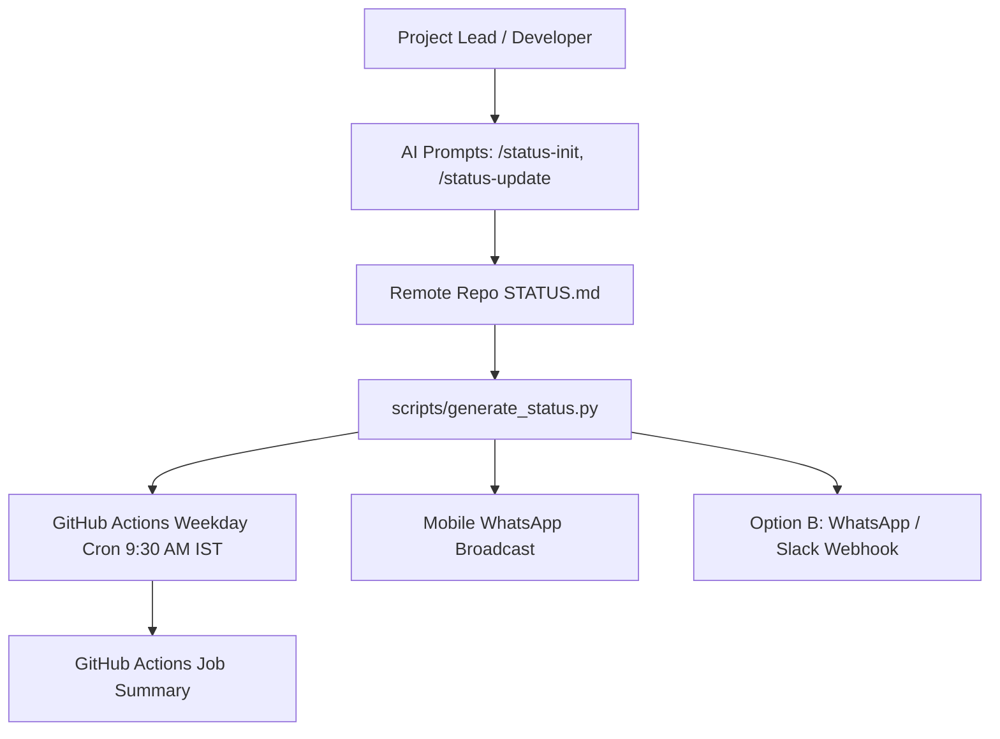

# LAB-000: Cetana Labs Control Hub & Protocol Engine

| Property | Value |
| :--- | :--- |
| **Project ID** | `LAB-000` |
| **Archetype** | 💻 Mini-App / Control Plane |
| **Status** | 🟢 Active |
| **Owner** | Eialarasu ([@agni-eialarasu](https://github.com/agni-eialarasu)) |
| **Remote Repository** | [github.com/agni-eialarasu/cetana-labs](https://github.com/agni-eialarasu/cetana-labs) |
| **Authoritative Changelog** | [github.com/agni-eialarasu/cetana-labs/commits/main](https://github.com/agni-eialarasu/cetana-labs/commits/main) |
| **Executive Status** | [STATUS.md](STATUS.md) |
| **Last Updated** | 2026-09-23 |

---

## 1. Overview & Objectives
**Cetana Labs** is the central engineering command plane, lab notebook, and automated management reporting engine across all active engineering initiatives. It standardizes project lifecycle states, automates executive WhatsApp briefings, and maintains a zero-overhead interface for developers and leadership.

---

## 2. Key Architecture & Protocol Engine

- **Protocol Core**: Authoritative 30-line `STATUS.md` specification adhering to a strict 5-section schema.
- **Reporting Engine**: Standalone zero-dependency Python generator (`scripts/generate_status.py`) producing WhatsApp-optimized markdown briefings.
- **Automated Cadence**: Weekday morning GitHub Actions workflow (`.github/workflows/project-status-cron.yml`) at 9:30 AM IST.
- **AI Agent Skill Suite**: Slash commands (`/project-status`, `/project-add`, `/project-update`, `/project-edit`) for autonomous lifecycle management.

---

## 3. Quick Links & Documentation
- 📋 [Executive Status (STATUS.md)](STATUS.md) — 30-line executive status, health, and latest deliverables.
- 🗓️ [Project Journal](journal.md) — Phase history, architectural decisions, and milestone timeline.
- 📘 [Authoritative STATUS Protocol](../../docs/project-protocol.md) — Schema specification.
- 👥 [Project Owner Guide](../../docs/project-owner-guide.md) — Developer AI prompt pack.
