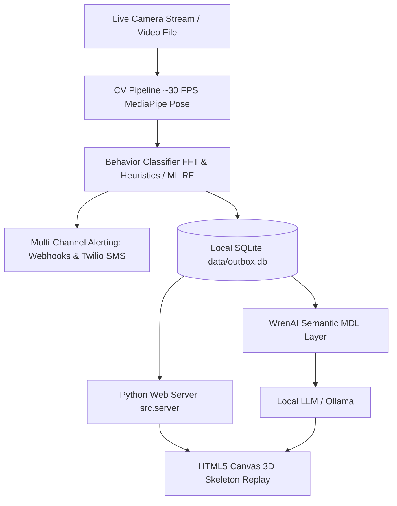

# LAB-001: Autism Activity Monitoring & Alerting System (AAMAS)

| Property | Value |
| :--- | :--- |
| **Project ID** | `LAB-001` |
| **Archetype** | 💻 Mini-App / Coding |
| **Status** | 🟢 Active |
| **Owner** | Eialarasu ([@agni-eialarasu](https://github.com/agni-eialarasu)) |
| **Remote Repository** | [github.com/agni-eialarasu/ammas](https://github.com/agni-eialarasu/ammas) |
| **Authoritative Changelog** | [github.com/agni-eialarasu/ammas/blob/main/CHANGELOG.md](https://github.com/agni-eialarasu/ammas/blob/main/CHANGELOG.md) |
| **Executive Status** | [STATUS.md](STATUS.md) |
| **Last Updated** | 2026-09-23 |

---

## 1. Overview & Objectives
**AAMAS** is a lightweight, self-contained Python edge monitor and video ingestion system designed for privacy-first behavioral state detection in real time:
- **Normal behavior**
- **Stimming** (repetitive hand-flapping, dedicated ears-closed subtype)
- **Physical Avoidance** (covering ears, closing eyes)

It dispatches sub-second episode alerts via HTTP Webhooks and optional Twilio SMS, coupled with an interactive HTML5/Canvas 3D skeleton playback dashboard and an embedded conversational GenBI layer (WrenAI + Ollama).

---

## 2. Key Architecture & Tech Stack

- **Runtime & CV**: Python 3.11+, MediaPipe Pose Landmarker, OpenCV, NumPy, SciPy (FFT frequency analysis), scikit-learn.
- **Privacy Core**: In-memory frame processing with instant frame purge on every iteration; stores only downsampled 11-joint 3D coordinate trajectories (`data/outbox.db`).
- **Telemetry & Web**: Built-in zero-dependency local HTTP server (`src.server`) serving an interactive HTML5/Canvas replay viewer.
- **Conversational Analytics (v2.0)**: Embedded "Ask AI" powered by WrenAI semantic modeling (`wrenai/mdl/manifest.json`) and local Ollama models.

---

## 3. Quick Links & Documentation
- 📋 [Executive Status (STATUS.md)](STATUS.md) — 30-line executive status, health, and latest deliverables.
- 🗓️ [Project Journal](journal.md) — Phase history, architectural decisions, and milestone timeline.
- 📘 [Operational Runbooks](https://github.com/agni-eialarasu/ammas/blob/main/README.md) — Maintained directly in the project codebase.
