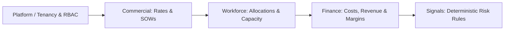

# LAB-003: Nexus Pulse — Governed Deterministic Vertical Engine

| Property | Value |
| :--- | :--- |
| **Project ID** | `LAB-003` |
| **Archetype** | 💻 Mini-App / Coding |
| **Status** | 🟢 Active |
| **Owner** | Hariharasubramanian ([@eAgni-Technologies](https://github.com/eAgni-Technologies)) |
| **Remote Repository** | [github.com/eAgni-Technologies/nexus-pulse](https://github.com/eAgni-Technologies/nexus-pulse) |
| **Last Updated** | 2026-09-09 |

---

## 1. Overview & Objectives
**Nexus Pulse** is an enterprise operational and financial intelligence engine built as a modular monolith with strict bounded-context contracts. It executes an authoritative deterministic vertical pipeline:

```text
Platform/Tenancy → Commercial → Delivery → Workforce → Finance → Signals
```

Authoritative business calculations and financial logic live in governed deterministic services, which are reused across UI, Signals, AI, Scenario, and Reporting consumers.

---

## 2. Key Architecture & Bounded Contexts



- **Platform / Security**: Multi-tenant kernel, five-role RBAC (`T-002`), scoped fail-closed evaluator.
- **Commercial**: Tenant-scoped Client/MSA/SOW/SOW-line persistence (`T-003`) and authoritative effective-dated bill-rate resolution (`T-004`).
- **Workforce**: Time-phased assignment/allocation validation and deterministic over/under capacity queries (`T-007`).
- **Finance**: Governed metric governance engine (`T-013A`), actual delivery costs, revenue, gross margin, and forecast-vs-baseline variance (`T-009..T-013`) against golden fixture `NP-GOLDEN-001`.
- **Signals**: Deterministic rule engine (`T-014..T-016`) evaluating margin erosion (SIG-01), SOW consumption risk (SIG-02), allocation risk (SIG-03), and delivery capacity constraints (SIG-04).

---

## 3. Tech Stack
- **Language / Runtime**: Python 3.11+
- **Frameworks & Core**: Starlette / FastAPI, SQLAlchemy, Alembic, Pydantic
- **Testing & Quality**: Pytest (126 unit/integration tests passed), Architecture fitness rules
- **Fixtures**: Self-contained `NP-GOLDEN-001` canonical datasets and answer keys

---

## 4. Documentation Links
- 📘 [Operational Runbook](runbook.md) — Fast start, testing commands, golden fixture usage, and troubleshooting.
- 🗓️ [Project Journal](journal.md) — Phase history, completed increments (T-001 through T-016), and milestone timeline.
