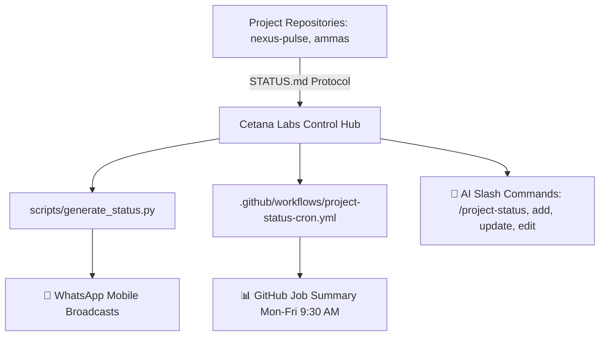

# LAB-004: Cetana Labs Control Hub & Protocol Engine

| Property | Value |
| :--- | :--- |
| **Project ID** | `LAB-004` |
| **Archetype** | 💻 Mini-App / Coding |
| **Status** | 🟢 Active |
| **Owner** | Eialarasu ([@agni-eialarasu](https://github.com/agni-eialarasu)) |
| **Remote Repository** | [github.com/agni-eialarasu/cetana-labs](https://github.com/agni-eialarasu/cetana-labs) |
| **Executive Status** | [STATUS.md](STATUS.md) |
| **Last Updated** | 2026-09-23 |

---

## 1. Overview & Objectives
**Cetana Labs Control Hub** is the central engineering command plane, lab notebook, and automated executive reporting system across our active portfolio of research spikes, edge services, and enterprise products.

It eliminates manual management reporting overhead by establishing a strict, machine-readable `STATUS.md` protocol and providing AI-assisted slash commands for on-demand WhatsApp executive summaries and weekday automated broadcasts.

---

## 2. Key Architecture & Components

- **Protocol Core**: Standardized 30-line `STATUS.md` schema powering deterministic executive summaries.
- **Reporting Engine**: Standalone Python 3 status generator (`scripts/generate_status.py`) producing WhatsApp-formatted updates without external dependencies.
- **Automated Broadcast**: Weekday cron job via GitHub Actions publishing daily briefings to GitHub Step Summary.
- **Universal Agent Suite**: Slash commands (`/project-status`, `/project-add`, `/project-update`, `/project-edit`) supporting Cursor, Claude Code, Copilot, and Antigravity.

---

## 3. Documentation Links
- 📋 [Executive Status (STATUS.md)](STATUS.md) — 30-line executive status, health, and latest deliverables.
- 🗓️ [Project Journal](journal.md) — Phase history, architectural decisions, and milestone timeline.
- 📖 [User Guide](../../docs/user-guide.md) — Central playbook for navigating projects and using commands.
