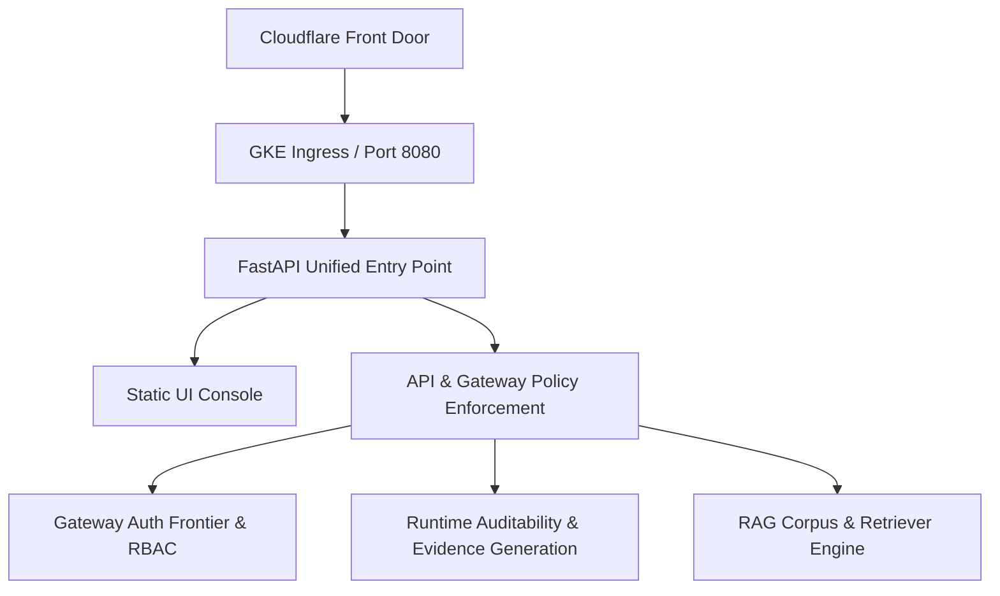

# LAB-004: Zerobea.ai — AI Security Control Plane

| Property | Value |
| :--- | :--- |
| **Project ID** | `LAB-004` |
| **Archetype** | 💻 Mini-App / Coding |
| **Status** | ⏳ Onboarding Pending |
| **Owner** | Abishek Singhavi |
| **Remote Repository** | [github.com/zerobeadotai/zerobea.ai](https://github.com/zerobeadotai/zerobea.ai) |
| **Staging Target** | [staging.zerobea.ai](https://staging.zerobea.ai) |
| **Executive Status** | [STATUS.md](STATUS.md) |
| **Last Updated** | 2026-09-23 |

---

## 1. Overview & Objectives
**Zerobea.ai** is an enterprise AI security control plane and governed gateway platform. It establishes a multi-tenant runtime auth frontier, gateway-first policy enforcement, runtime auditability, and canonical data models for safe generative AI operations.

---

## 2. Key Architecture & Platform Topology

- **Runtime & Deployment**: Single-image containerized deployment on GKE via GitHub Actions CI/CD.
- **Unified Entry Point**: FastAPI server hosting both the static UI and governed `/api` routes on port 8080.
- **Security & Tenancy**: Subdomain-driven multi-tenancy, gateway-first policy enforcement, and runtime evidence generation.

---

## 3. Quick Links & Documentation
- 📋 [Executive Status (STATUS.md)](STATUS.md) — 30-line executive status, health, and latest deliverables.
- 🗓️ [Project Journal](journal.md) — Phase history, architectural decisions, and milestone timeline.
- 📘 [Platform Seed Framework](https://github.com/zerobeadotai/zerobea.ai/blob/main/docs/architecture/platform-seed-framework.md) — Maintained directly in the project codebase.
