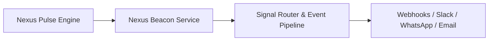

# LAB-006: Nexus Beacon

| Property | Value |
| :--- | :--- |
| **Project ID** | `LAB-006` |
| **Archetype** | 💻 Mini-App / Coding |
| **Status** | ⏳ Onboarding Pending |
| **Owner** | Arun Elambaram |
| **Remote Repository** | [github.com/eAgni-Technologies/nexus-beacon](https://github.com/eAgni-Technologies/nexus-beacon) |
| **Executive Status** | [STATUS.md](STATUS.md) |
| **Last Updated** | 2026-09-23 |

---

## 1. Overview & Objectives
**Nexus Beacon** is a telemetry, event notification, and operational beacon service designed to broadcast real-time signals, operational alerts, and workflow notifications across the Nexus enterprise platform.

---

## 2. Key Architecture & Platform Topology

- **Remote Codebase**: [github.com/eAgni-Technologies/nexus-beacon](https://github.com/eAgni-Technologies/nexus-beacon)
- **Role**: Companion alerting, broadcast, and telemetry layer for the vertical enterprise operations engine.

---

## 3. Quick Links & Documentation
- 📋 [Executive Status (STATUS.md)](STATUS.md) — 30-line executive status, health, and latest deliverables.
- 🗓️ [Project Journal](journal.md) — Phase history, architectural decisions, and milestone timeline.
